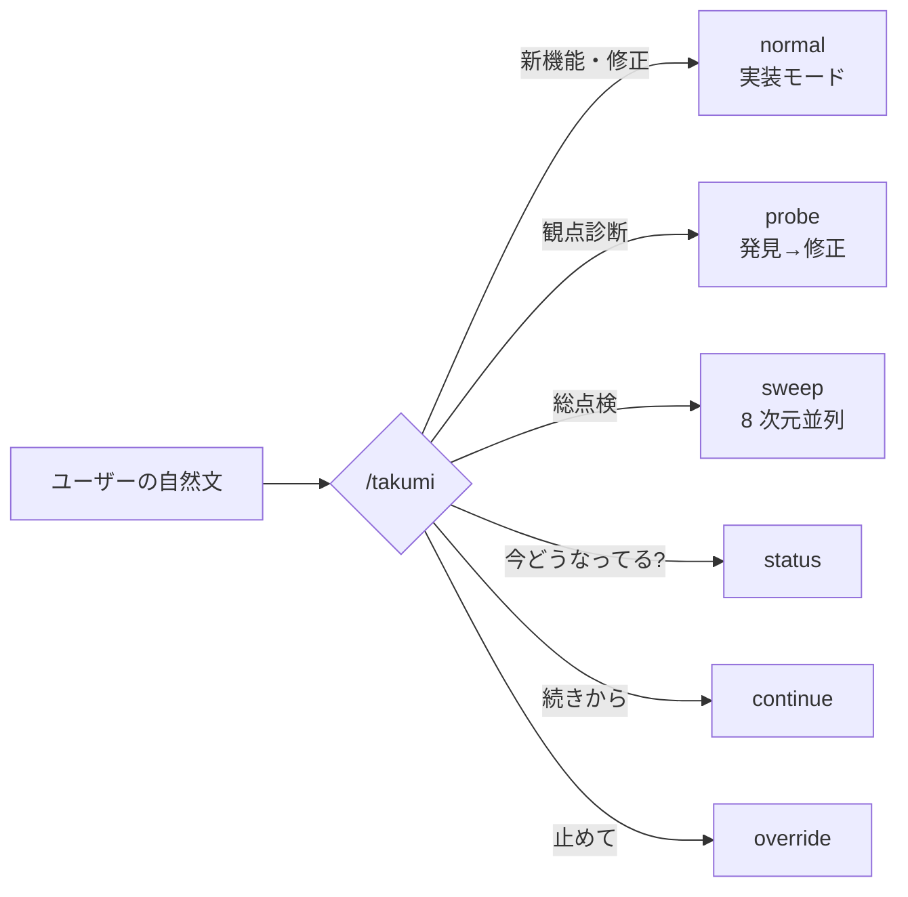
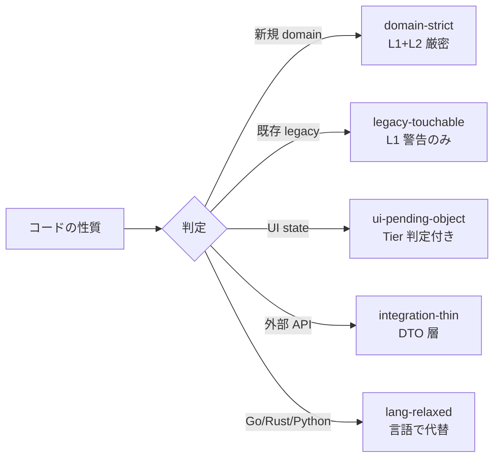
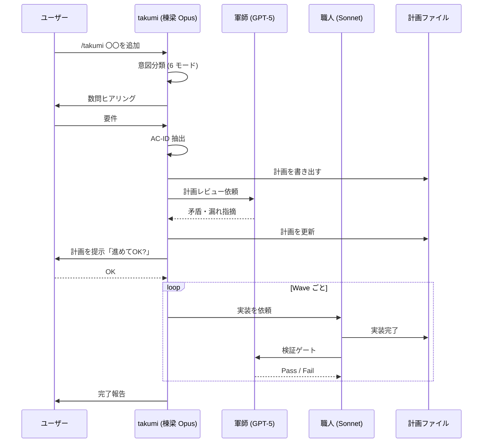

<div align="center">

# takumi

**Claude Code で、あなたの開発チームをまるごと 1 つのコマンドに。**

[](LICENSE)
[](https://docs.claude.com/claude-code)
[](https://github.com/NAM-MAN/takumi/releases)
[](skills/takumi)

</div>

---

```
/takumi 管理画面に CSV エクスポート機能を追加
```

このひとことで、要件のヒアリングから設計・実装・テスト作成・レビューまで、シニアエンジニア数名ぶんの仕事が走り出します。

> [!TIP]
> **はじめての方へ** — まず「[こんなお悩み](#こんなお悩みありませんか)」からお読みください。技術用語の意味は、初出の箇所でそのつど解説します。

---

## 目次

- [こんなお悩み、ありませんか?](#こんなお悩みありませんか)
- [takumi でできること](#takumi-でできること6-つの特徴)
  - [1. 覚えるコマンドは `/takumi` ひとつだけ](#1-覚えるコマンドは-takumi-ひとつだけ)
  - [2. 持っていないレビュー観点が、その場で手に入る](#2-自分が今持っていないレビュー観点が-その場で手に入る)
  - [3. この 50 年で一番マシなテスト手法](#3-テストをここ-50-年で一番マシな方法で書いてくれる)
  - [4. 設計の知恵をルール化](#4-リファクタリングに人類が長年積み上げてきた知恵を込めてあります)
  - [5. 計画ファイル化で長時間運転](#5-計画ファイル化--放置してもずっと動き続けます)
  - [6. 4 ロールを使い分け](#6-4-つのロールがそれぞれ得意分野で動く)
- [インストール](#インストール)
- [プロンプト例](#実際に話しかけてみましょう)
- [他ハーネスとの違い](#他のハーネスとの違い)
- [よくあるご質問](#よくあるご質問)

---

## こんなお悩み、ありませんか?

AI コーディング支援ツール (Claude Code、Cursor、Cline、Aider など。こうしたツールはまとめて「**ハーネス**」と呼ばれます) を使っていると、こんな壁にぶつかることがあります。

| お悩み | 心当たり? |
|---|---|
| AI に実装を頼んでも、テストが甘くて本番で壊れる | ✓ |
| セキュリティ・パフォーマンスの観点を、ひとりで見きれない | ✓ |
| 大きな機能を任せると、途中で話が脱線する | ✓ |
| 長時間の作業を任せたいが、席を外すと止まってしまう | ✓ |
| コマンド・スキルが多すぎて、いつ何を使うのか覚えきれない | ✓ |
| AI が書いたコードを、どうレビューすればいいのか迷う | ✓ |

takumi は、これらの課題を Claude Code の標準機能の上に積み上げた 1 枚のスキルで解決します。

---

## takumi でできること (6 つの特徴)

### 1. 覚えるコマンドは `/takumi` ひとつだけ

> [!NOTE]
> AI 開発ツールはコマンドが増える傾向にあります。Claude Code 標準でも `/plan`、`/review`、`/security-review` があり、Cursor には Composer、Cline には Plan / Act Mode と、ハーネスごとに異なる概念を覚える必要があります。

takumi は逆の発想です。**入り口を `/takumi` 1 つに絞り、自然な日本語を投げるだけで、中で自動的にモード分岐します。**



**こう話しかけると、中ではこう動きます:**

| こう話しかけると | 中ではこう動きます |
|---|---|
| `/takumi 商品一覧にソートを追加` | 新機能を実装するモード |
| `/takumi security 見て` | セキュリティ観点で診断するモード |
| `/takumi リリース前に全般見て` | 全方位で総点検するモード |
| `/takumi 今なに動いてる?` | 現在の状態を確認 |
| `/takumi 続きから` | 前回の途中から再開 |
| `/takumi 止めて` | 一時停止 |

命令を丸暗記する必要はありません。「こう言えばこう動くかな」という直感でおおむね通じます。迷ったときだけ、takumi が 1 問だけ聞き返します。

---

### 2. 「自分が今持っていないレビュー観点」が、その場で手に入る

一人前のエンジニアになるには、実装力だけでなく、コードを多角的に読む「レビュー観点」を身につける必要があります。たとえば次のようなものです。

- **セキュリティレビュー** — SQL インジェクション、権限昇格、CSRF といった攻撃経路を見抜く観点
- **パフォーマンスレビュー** — N+1 クエリ (1 件ごとに DB を叩いてしまう問題)、不要な再レンダリング、メモリリーク
- **アクセシビリティレビュー** — WCAG (Web Content Accessibility Guidelines) への準拠、スクリーンリーダー対応、キーボード操作
- **リファクタリングレビュー** — 責務分離、依存の向き、命名の適切さ
- **テスト戦略レビュー** — 何をどの層で守るのか、不要なテストはないか

これらをすべて高い水準で維持するのは、10 年選手でも難しいことです。

> [!IMPORTANT]
> takumi には、これらの観点に対応する専門スキルが内蔵されています。`/takumi security 見て` と話しかけるだけで、該当するレビューが自動で走ります。

| 内蔵スキル | 役割 |
|---|---|
| **strict-refactoring** | リファクタリング・設計指針 |
| **verify** | テスト戦略 (6 層) |
| **design** | UI の情報設計・スタイルガイド・ワイヤーフレーム |
| **probe** | 観点指定の発見→修正 |
| **sweep** | 8 次元並列の総点検 |
| **verify-loop** | mutation score 長時間積み上げ |

つまり、**これまでチームに居なかった専門家が、会話ひとつで一時的に加わるような体験**です。まだ経験が浅くても、シニアが隣でレビューしているのと同じような観点で、自分のコードを見てもらえます。

---

### 3. テストを、ここ 50 年で一番マシな方法で書いてくれる

少し丁寧にご説明させてください。ソフトウェアテストは歴史的に、次のような流れをたどってきました。

> [!WARNING]
> **昔ながらのテスト (example-based unit test)** — 「入力 A を渡したら B が返ること」を 1 つずつ書く方式。人間が思いついた入力しか試せないので、境界値や組み合わせの漏れが起きやすい。

> [!WARNING]
> **カバレッジ至上主義** — 「テストで実行されたコード行の割合」を 80% などの目標で管理する方式。しかし、行が実行されていても assert が甘ければ何も守れていない。**研究によると、カバレッジ 80% でもバグの 30% 以上を見逃す**ことが知られています。

**ここ 50 年で研究者たちが提案してきた、本当にいい指標たち:**

| 手法 | 概要 | 発表年 |
|---|---|---|
| **Mutation Testing** | 本番コードを少しずつ書き換え (`>` → `>=` 等)、そのバグをテストが検知できるかで鋭さを測る | 1971 |
| **Property-Based Testing (PBT)** | 「どんな入力でも成り立つ性質」を書き、ライブラリが 1 万件ランダム生成して試す | 1999 (QuickCheck) |
| **Metamorphic Testing** | 正解がない領域で、入力の変換と出力の関係で検証する (画像・ML・LLM) | 1998 |
| **Model-Based Testing** | 状態機械を書いて、操作列をランダム生成して試す | 1990 年代 |

> [!CAUTION]
> **これらが普及してこなかった理由はひとつで、人間が使うには難しすぎたからです。**
> 「どんな入力でも成り立つ性質」を言語化するのも、正解のない出力に「関係」を定義するのも、状態機械を正しく設計するのも、かなりの専門性を要求します。

AI によってその障壁がほぼ消えました。takumi は仕様 (後述する **AC-ID**) と関数シグネチャから、これらのテストを自動生成します。ユーザーがやることは **「何を守りたいか」を日本語で伝えること**、それだけです。

> [!TIP]
> **1 unit = 1 test file = 仕様書**。生成されるテストは `.pbt.test.ts` / `.mutation.test.ts` 等に分割せず、`{module}.test.ts` 1 本に統合され、各 `it('{Subject} は {input} に対して {output} を返すべき')` が**仕様文**として読めます。機構 (PBT, metamorphic) は it body の中で選ばれる実装詳細であって、ファイル名に漏らしません。詳細は [`skills/takumi/verify/spec-tests.md`](skills/takumi/verify/spec-tests.md)。

> [!IMPORTANT]
> **Mutation Testing の対応言語は tier で分かれます**。JS/TS (Stryker-JS) / Java/Kotlin (PIT) / C# (Stryker.NET) / Rust (cargo-mutants) / Scala (Stryker4s) は **primary** (mutation score を hard gate に使える)、Python (mutmut) / Go (gremlins) は **advisory** (operator 覆盖が不足するため telemetry 参考値のみ、主守りは PBT + AI Review)、その他言語は **L4 skip**。詳細は [`skills/takumi/verify/mutation.md`](skills/takumi/verify/mutation.md) の「対応言語と tier」。

---

### 4. リファクタリングに、人類が長年積み上げてきた知恵を込めてあります

リファクタリングや設計判断は「正解がない」と言われがちですが、実際には**コミュニティが長年かけて発見してきた、より良いパターン**というものが存在します。

<table>
<tr>
<th>パターン</th>
<th>発祥</th>
<th>要点</th>
</tr>
<tr>
<td><b>OOP</b></td>
<td>1970 年代</td>
<td>カプセル化・責務分離</td>
</tr>
<tr>
<td><b>関数型 (FP)</b></td>
<td>1950 年代〜</td>
<td>純粋関数、副作用の分離</td>
</tr>
<tr>
<td><b>DDD</b></td>
<td>2003 年 Evans</td>
<td>ドメインを中心に設計</td>
</tr>
<tr>
<td><b>CQRS</b></td>
<td>2010 年頃〜</td>
<td>Command と Query を分離</td>
</tr>
<tr>
<td><b>Pending Object Pattern</b></td>
<td>UI state 管理</td>
<td>中間状態を validate してからコミット</td>
</tr>
</table>

takumi の **strict-refactoring スキル**は、これらの蓄積をチェックリストとして持っています。しかもコンテキストに応じて**強度を可変**にします。



「教科書には書いてあるけれど現場では守れない」というパターンを、場所と状況に応じて柔軟に運用します。

---

### 5. 計画ファイル化 — 放置してもずっと動き続けます

大きな機能を AI に頼むと、最初は調子よく進むのに、途中から話が脱線したり、文脈を見失ったりする経験、ありませんか?

> [!IMPORTANT]
> takumi は会話を始めてすぐ、やることを `.takumi/plans/{機能名}.md` というテキストファイルに書き出します。これが強みの源泉です。

**ファイル化には 3 つの利点があります。**

> [!NOTE]
> **A. いつでも再開できます** — セッションが切れようと、PC を閉じようと、`/takumi 続きから` のひとことで続きに戻れます。AI が持っていた作業記憶は計画ファイルに吐き出されているので、再読み込みするだけで続きが走ります。

> [!NOTE]
> **B. 長時間の自動運転に強いです** — 100 個以上のタスクに膨らんだ大きな計画でも、Wave ごとに検証ゲートを通しながら進むので迷子になりません。寝る前に `/takumi リリース前の総点検` と投げて、朝コーヒーを淹れるころには 50 件の問題が片付いていた、ということが現実に起こります。

> [!NOTE]
> **C. 人間がレビューできます** — AI がコードを書き始める**前**に、計画のテキストを人間が読んでレビューできます。「Wave 3 の認可タスクは粒度が粗い、2 つに分けて」のようなフィードバックが自然に返せます。

また、大きな総点検では**自己増殖型計画**になります。実装中に見つけた別の問題は `discovered-{id}.md` に記録され、Wave 完了時に計画に追記されます。**計画そのものが、作業しながら成長していきます。**

---

### 6. 4 つのロールが、それぞれ得意分野で動く

takumi は内部で、役割に応じて 4 種類の AI エージェントを使い分けます。

| ロール | モデル | 担当 | ポイント |
|---|---|---|---|
| **棟梁** (とうりょう) | Claude Opus | 全体設計・計画作成 | 会話の中心 |
| **軍師** (ぐんし) | OpenAI GPT-5 | 敵対的レビュー | 別系統モデルで交差レビュー |
| **職人** (しょくにん) | Claude Sonnet | 実装・テスト作成 | 手を動かす |
| **斥候** (せっこう) | Claude Haiku | コードベース探索 | 軽量で高速 |

> [!TIP]
> **軍師** が特に大事です。同じモデル系列に頼ると、同じクセで同じ見落としをします。**別系統のモデル (GPT-5)** にクロスレビューを依頼することで、「ある AI には見えなかった問題」が見えるようになります。

---

## インストール

> [!IMPORTANT]
> **前提**: [gh CLI](https://cli.github.com/) v2.90.0 以上

```bash
gh skill install NAM-MAN/takumi
```

Claude Code を開いて、スラッシュコマンドの補完に `/takumi` が出てくれば成功です。

```bash
# 中身を事前に確認したいとき
gh skill preview NAM-MAN/takumi takumi

# アンインストール
gh skill uninstall takumi
```

---

## 実際に話しかけてみましょう

インストール後、プロジェクトのルートで `/takumi` とだけ送ると、プロジェクトの種別 (UI を含むか、バックエンドのみかなど) を 1 問だけ聞かれます。そこから先は自然文で構いません。

<details>
<summary><b>新機能を作りたいとき</b> (クリックで展開)</summary>

```
/takumi Stripe 決済を追加。単発購入のみ、サブスクリプションはなし
/takumi ユーザー削除に GDPR 対応の論理削除と cascade を入れる
/takumi 記事投稿画面に 10 秒ごとの下書き自動保存を追加
/takumi 管理画面の商品一覧にソート・フィルター・CSV エクスポート
/takumi Webhook エンドポイントに署名検証を追加
```
</details>

<details>
<summary><b>既存のバグを直したいとき</b></summary>

```
/takumi ログイン後の遷移が遅い、原因を調べて直して
/takumi N+1 が出てそうな API を探して修正
/takumi 検索が壊れている。特定の入力で 500 になる
/takumi 通知メールの文面を刷新したい。既存の雰囲気は崩さずに段階的に
```
</details>

<details>
<summary><b>観点別に診断したいとき (コードは触らずに、まず調べる)</b></summary>

```
/takumi security 見て
/takumi 認可ロジック、権限昇格の抜けがないか調べて
/takumi パフォーマンスが心配。遅い top 5 の endpoint を洗い出して
/takumi a11y 調べて。WCAG AA で落ちそうなところ
/takumi 並行編集が怪しい。レースコンディションの可能性ある?
```

> [!NOTE]
> 観点診断モードではまず**発見**だけを行い、`.takumi/sprints/{日付}/discoveries.md` に結果を書き出します。そのうえで「提案 1 と 3 だけ直して」と指示すれば、修正計画の生成に進みます。いきなりコードを触らないので、様子見に最適です。
</details>

<details>
<summary><b>リリース前に総点検したいとき</b></summary>

```
/takumi リリース前に全般見て
/takumi 総点検。security、パフォーマンス、a11y、dx 全部
/takumi 来週リリースなのでリリースブロッカーだけ洗い出して
```
</details>

<details>
<summary><b>リファクタリング・設計相談</b></summary>

```
/takumi この UserService、責務が多すぎる気がする
/takumi 状態管理が複雑化してきた。整理できる?
/takumi 既存の checkout 画面、リファクタ観点で見直して
```
</details>

<details>
<summary><b>テストを強化したいとき</b></summary>

```
/takumi PricingCalculator に PBT を追加して mutation score を 80% 以上にして
/takumi この feature のテスト戦略を提案して
/takumi 画像リサイズ関数、正解がないので metamorphic な性質で守って
```
</details>

<details>
<summary><b>デザインを含む新機能 (UI 設計から)</b></summary>

```
/takumi SaaS の pricing page を作って。参考: Linear、Vercel。トーン: 落ち着いた monochrome
/takumi 管理画面のダッシュボードをダークモード対応に刷新
```
</details>

<details>
<summary><b>運用コマンド</b></summary>

```
/takumi 今なに動いてる?
/takumi 続きから
/takumi 止めて
/takumi auth の loop だけ止めて、mutation loop は続けて
```
</details>

---

## 他のハーネスとの違い

Cursor、Cline、Aider、Continue.dev など、モードや計画の概念自体は既に各ハーネスに存在します。takumi の立ち位置を比較します。

|  | Cursor Composer | Cline Plan/Act | Aider /architect | **takumi** |
|---|:-:|:-:|:-:|:-:|
| モード選択 | ユーザー | ユーザー | ユーザー | **自然文から自動推定** |
| 計画の永続化 | セッション内 | セッション内 | セッション内 | **ファイルとして git 管理** |
| セッション跨ぎ再開 | 限定的 | 限定的 | 限定的 | **`続きから` 1 語で復元** |
| テスト戦略の内蔵 | なし | なし | なし | **PBT / mutation / metamorphic** |
| リファクタ指針の内蔵 | なし | なし | なし | **CQRS / DDD / Pending Object** |
| 別モデルの交差レビュー | なし | なし | なし | **軍師ロール (GPT-5)** |

> [!TIP]
> takumi は Claude Code の上に乗るスキルで、Claude Code 自体を置き換えるものではありません。**むしろ Claude Code の標準機能を前提に、その上で「長時間・大規模・高品質」を実現するための仕組みを積んでいる、と捉えてください。**

---

## 裏側でなにが起こっているか

気になる方向けに、takumi が自然文を受けてからの内部フローをご紹介します。



内部の詳細は [skills/takumi/SKILL.md](skills/takumi/SKILL.md) をご覧ください。

---

## よくあるご質問

<details>
<summary><b>Q. Claude Code 以外のハーネス (Cursor、Cline、Aider など) でも使えますか?</b></summary>

現時点では Claude Code 専用です。takumi は Claude Code の skills システムの上に成り立っているため、同等の仕組みがない環境では動きません。将来的な移植可能性は検討中です。
</details>

<details>
<summary><b>Q. 日本語以外でも動きますか?</b></summary>

動きますが、意図分類の辞書が日本語に最適化されています。英語でも動作はしますが、観点語・診断動詞のマッチ精度はやや落ちます。`natural-language.md` に辞書を足すことで改善できます。
</details>

<details>
<summary><b>Q. 途中で止めたら、書きかけのコードはどうなりますか?</b></summary>

Wave 単位で中断されるため、完了済みの Wave の成果物は残り、途中だった Wave は破棄されます。次回 `/takumi 続きから` で、その Wave の冒頭から再開されます。
</details>

<details>
<summary><b>Q. どこにファイルが書かれますか? 既存コードは勝手に触られませんか?</b></summary>

takumi が書くファイルは `.takumi/` 配下のみです。既存コードは、ユーザーが明示的に「実装して」と頼んだときだけ変更されます。観点診断モードでは 1 行も触りません。
</details>

<details>
<summary><b>Q. AC-ID とは何ですか? 覚えなくてはいけませんか?</b></summary>

Acceptance Criteria (受け入れ条件) の ID です。たとえば `AC-AUTH-002` のような形をしています。要件を原子単位で表したもので、**仕様・計画・テスト・レビューをつなぐ共通言語**になります。ユーザーが書く必要はなく、AI が発話から抽出して提示するので、OK/修正を返すだけで大丈夫です。
</details>

<details>
<summary><b>Q. mutation score の目標値はいくつですか?</b></summary>

takumi のデフォルトは 65-80% の幅です。新規のドメインコードでは 80% 以上、既存レガシーに手を入れる場合は 65% など、プロジェクトの状況に応じて profile で可変です。`mutation_floor` を下回る場合は、次の Wave に進みません。
</details>

<details>
<summary><b>Q. `.takumi/` はコミットすべきですか? 個人開発とチーム開発で違いますか?</b></summary>

**デフォルトは `.takumi/` 全体を `.gitignore`** にします。プロジェクトルートを clean に保ち、中間状態がリポジトリに混入しないようにするためです。個人開発ではこのまま運用してください。

チームで運用する場合、以下のディレクトリは **必要に応じて個別に unignore** できます:

| ディレクトリ | 個別 unignore | 理由 |
|---|:-:|---|
| `plans/` | 候補 | PR に添えてレビュー対象にしたい場合 |
| `specs/` | 候補 | AC-ID をチームの契約 (source of truth) としたい場合 |
| `design/` | 候補 | デザイン成果物をチームで共有したい場合 |
| `profiles/` | 候補 | チーム共通の verify/design/refactor 基準を共有したい場合 |
| `sprints/` | ❌ | セッション固有、共有しても雑音 |
| `telemetry/` | ❌ | 内部メトリクス、history が個人差依存 |
| `control/` | ❌ | 一時的な指示、session ごとに使い捨て |
| `drafts/` / `notepads/` / `state.json` | ❌ | 作業中の走り書き、semester 共有の意味なし |

`.gitignore` の書き方例 (チーム運用・plans と specs だけ共有):

```
.takumi/
!.takumi/plans/
!.takumi/specs/
```

判断の基準: 「**他の開発者 (or 未来の自分) がこのファイルを読んで得をするか**」が Yes のものだけ unignore、それ以外は default (ignore) のまま。

</details>

<details>
<summary><b>Q. 実装中に予定外の問題を見つけたら、どうなりますか?</b></summary>

担当外の発見は `.takumi/drafts/discovered-{id}.md` に記録され、その場では触られません。Wave 完了時に棟梁が統合して計画に追記し、次の Wave で扱います。重大な問題 (P0) は次バッチに割り込みで入ります。
</details>

<details>
<summary><b>Q. TypeScript 以外の言語でも使えますか?</b></summary>

使えますが、Mutation Testing (L4) の効力が言語によって tier 分けされています。**ツールの成熟度**ではなく、**生成されるミュータントの質 (operator 覆盖)** で判定しています。

| tier | 言語 | ツール | L4 の役割 |
|---|---|---|---|
| **primary** | JS/TS | Stryker-JS | mutation score を hard gate に使える |
| **primary** | Java/Kotlin | **PIT (PITest)** | bytecode mutation で Stryker 同等以上 |
| **primary** | C# | Stryker.NET | Stryker 系列、同 philosophy |
| **primary** | Rust | cargo-mutants | `--in-diff` 必須、フル run は不可 |
| **primary** | Scala | Stryker4s | Stryker 系列 |
| **advisory** | Python | mutmut / cosmic-ray | operator 覆盖が薄いため telemetry 参考値のみ、主守りは PBT + AI Review |
| **advisory** | Go | gremlins | 同上 |
| **skip** | その他 | なし | L4 完全 skip、PBT + AI Review で守る |

strict-refactoring 側の制約 (Command/Pure/ReadModel の 3 分類、Result 型など) は言語によって緩和されます。Go / Rust / Python は `lang-relaxed-go-rust` profile で型システムが代替できる制約を緩めてあります (詳細は [`skills/takumi/strict-refactoring/language-relaxations.md`](skills/takumi/strict-refactoring/language-relaxations.md))。

Mutation tier の詳細は [`skills/takumi/verify/mutation.md`](skills/takumi/verify/mutation.md) の「対応言語と tier」節を参照。
</details>

<details>
<summary><b>Q. 毎回 <code>.takumi/plans/</code> に計画ファイルが作られますか?</b></summary>

**デフォルトは必ず作られます**。計画ファイルは `.takumi/plans/` に書かれ、初回 bootstrap で `.takumi/` 全体が `.gitignore` 済みになるため **デフォルトでリポジトリを汚しません**。中断 / 再開 / 別チャットでの参照のために重要な役割を果たします。チームで plans を共有したい場合は上記 Q の通り `!.takumi/plans/` を個別 unignore してください。

ただし、以下 5 条件を**すべて**満たす場合のみ、会話内 (TaskCreate) での合意のみで直接実装に入る "in-conversation plan" を例外的に許容しています:

1. 対象が skill / ドキュメント / config ファイルの編集のみ (プロダクションコード・build・DB・CI 設定への影響ゼロ)
2. 会話内で Wave 構造がすでに棟梁とユーザーで合意済み
3. 規模が「小」〜「中」で 30 分以内の見込み
4. ユーザーが「計画 → 実装に進む」を明示承認
5. 全 Wave を TaskCreate で追跡可能

1 つでも欠けたら plan ファイルを生成します。判断に迷ったら必ず書く側に倒す、という運用です (詳細は `SKILL.md` の Step 4)。
</details>

<details>
<summary><b>Q. 始めるにあたって必要な前提知識は?</b></summary>

Claude Code を一度でも使ったことがあれば十分です。AC-ID や mutation score といった用語を事前に学ぶ必要はありません。takumi が対話のなかで必要なタイミングで説明します。
</details>

---

## `.takumi/` ディレクトリの中身

プロジェクト直下の `.takumi/` 以下だけにファイルが書かれます。

```
.takumi/
├── plans/                        # 計画ファイル (Wave 構成)
├── specs/                        # AC-ID による仕様
├── design/                       # サイトマップ・スタイルガイド・ワイヤーフレーム
├── profiles/                     # verify / design / refactor の設定
├── sprints/                      # 観点診断・総点検の実行記録
├── telemetry/                    # 指標の時系列ログ
├── control/                      # 一時停止などの制御ファイル
├── state.json                    # 現在のモードと実行中 ID
└── discovery-calibration.jsonl   # 発見者精度の履歴
```

> [!TIP]
> **デフォルト**: `.takumi/` 全体を `.gitignore`。プロジェクトルートを clean に保つ。
> **チーム運用で個別 unignore 候補**: `plans/` `specs/` `design/` `profiles/` (必要なものだけ `!.takumi/<dir>/` で例外化)

---

## 制限事項

> [!WARNING]
> - Claude Code 専用です (Anthropic API を直接利用する環境では動きません)
> - 意図分類は日本語に最適化されています
> - 軍師ロール (交差レビュー) は OpenAI Codex CLI (GPT-5) を使用します。未インストールでは Opus 代替で精度はやや落ちます
> - 自動判定を誤り続ける語彙があれば、`natural-language.md` の辞書に追加してください (PR 歓迎)

---

## 貢献

以下の領域は特に歓迎しています。

- `natural-language.md` — 観点語・診断動詞の辞書拡充
- `integration-playbook.md` — スキル間の矛盾解決パターン
- `strict-refactoring/language-relaxations.md` — 言語別の緩和ルール

## ライセンス

[MIT](LICENSE)

---

<div align="center">

まずは `/takumi` と話しかけることから始めてみてください。最初の一問は、きっと短く済むはずです。

</div>
