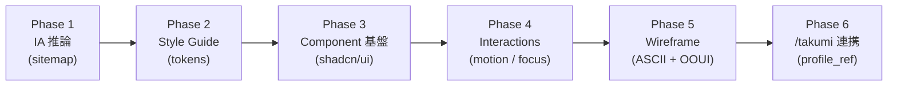
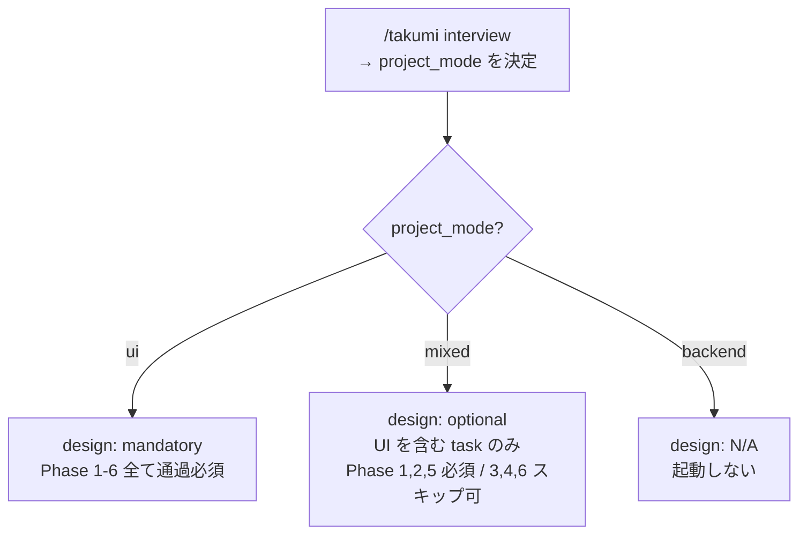

# design mode: UI の揺れを、最初から封じる (takumi 内部モード)

> [!NOTE]
> このファイルは takumi の **design mode** 内部 runtime doc です。独立した skill としての `/design` コマンドは廃止され、`project_mode=ui/mixed` の際に takumi の Step 0d として自動呼出されます。本文中に残る `/design` 形式の記述は runtime 手順上の擬似コマンド名であり、人間向けの入口は `/takumi` 1 つだけです。

<p align="center">
  
  
  
</p>

「Notion っぽく」「もう少しモダンに」で終わらない、**再現性のある UI 設計**へ。

```
/takumi <UI を含む機能を 1 行で>
```

project_mode が `ui` または `mixed` なら、takumi が Step 0d で design mode を自動起動します。たった 4 つの情報 (製品の種類・想定ユーザー・ブランドトーン・参考サイト 1-2 個) を渡すだけで、サイトマップ・スタイルガイド・ワイヤーフレーム・マイクロインタラクションが一気通貫で決まります。同じ入力からは同じ出力を返す **seeded design (種付きデザイン)** 方式です。

---

## 目次

- [こんなお悩み、ありませんか?](#こんなお悩みありませんか)
- [design が解決すること (6 つの視点)](#design-が解決すること-6-つの視点)
  - [1. 4 つの入力に絞る (過剰な問診をしない)](#1-4-つの入力に絞る-過剰な問診をしない)
  - [2. 同じ入力から、同じ出力を返します (Seeded Design Inference)](#2-同じ入力から同じ出力を返します-seeded-design-inference)
  - [3. 壊れ方を先に決めます (L7 Layout Invariant)](#3-壊れ方を先に決めます-l7-layout-invariant)
  - [4. サイトマップから wireframe まで一気通貫](#4-サイトマップから-wireframe-まで一気通貫)
  - [5. 技術スタックを固定 (選定疲れからの解放)](#5-技術スタックを固定-選定疲れからの解放)
  - [6. verify スキルと同時にゲート評価](#6-verify-スキルと同時にゲート評価)
- [Phase 1-6 のフロー](#phase-1-6-のフロー)
- [project_mode 分岐 (概観)](#project_mode-分岐-概観)
- [用語解説 (初めて聞く方へ)](#用語解説-初めて聞く方へ)

---

## こんなお悩み、ありませんか?

> [!TIP]
> 以下のどれかに当てはまるなら design スキルが刺さります。

- AI に UI を作らせると、同じ指示でも毎回違うものが出てくる
- 画面ごとにトーンがバラバラで、全体の一貫性が崩れている
- 「あとで調整」のつもりが、画面数が増えて直せなくなっている
- スタイルガイドを作っても、実装時に守られない
- overflow、ボタンが押せない、コントラスト不足など、ありがちなレイアウトバグが本番まで残る
- デザイナーに都度依頼できず、エンジニアだけで体裁の良い画面を作りたい

design スキルは、**「作ってから調整」ではなく「壊れ方と見え方を先に固定」**します。デザインのレビューコストを前払いする、というのがこのスキルの立ち位置です。

---

## design が解決すること (6 つの視点)

### 1. 4 つの入力に絞る (過剰な問診をしない)

UI 設計ツールの多くは、最初に膨大な質問をしてきます。design スキルは必須入力を 4 つだけに絞り込みました。この 4 つが揃えば、残りは全部自動で決まります。

- **製品の種類 (product_type)** — SaaS ダッシュボード / 消費者向けモバイル / LP / 管理画面 / 編集系キャンバス のどれか
- **想定ユーザー (target_user)** — 役割 + 状況 + 頻度を 1 文で (例: 「B2B SaaS の経理担当、月次で数回、他業務と並行しながら」)
- **ブランドトーン (brand_tone)** — 声のトーンを形容詞 2-3 語で (例: `serious, trustworthy, financial`、`playful, energetic, youth`)
- **参考サイト (ref_archetypes)** — 類似プロダクトを **1-2 個だけ** (例: `Linear, Vercel`)

> [!CAUTION]
> 参考サイトを 3 個以上指定すると、平均化されて個性が死にます。**2 個まで**という制限はこの結果を避けるための設計です。

### 2. 同じ入力から、同じ出力を返します (Seeded Design Inference)

AI に UI を任せると、同じ指示でも毎回違うものが出てきます。色、余白、角丸、モーション — 推論のたびに 10-20% ぶれます。このブレを許容すると、画面間で一貫性が崩れ、デザイントークン (色や間隔の変数) が形骸化します。

> [!IMPORTANT]
> design スキルは、4 つの入力を**決定論的に**トークンに落とし込みます。同じ入力なら同じトークンセット (色、タイポグラフィ、余白、角丸、シャドウ、モーション) が決まります。各画面はそのトークンを参照するだけなので、**後から「このボタンの色だけ違う」問題が起こりません**。

### 3. 壊れ方を先に決めます (L7 Layout Invariant)

画面を作ってから「この画面は overflow してる」「このボタンはタップ領域が小さすぎる」と気づくのは遅すぎます。design スキルは、**レイアウトの不変条件**を生成時ではなく検証時に機械的にチェックします。

3 層に分けて管理します:

- **Hard Gate (5-7 項目)** — 失敗したら即ブロック。overflow ゼロ、タップ領域 32px 以上、focus-visible、AA コントラスト、など
- **Soft Gate (4-6 項目)** — 警告のみ。閾値超過で fail。余白がトークンスケール通り、アイコンは lucide のみ、など
- **Lint (4-6 項目)** — eslint / stylelint で静的解析。カラートークン以外禁止、任意の Tailwind クラス禁止、など

> [!WARNING]
> Hard Gate は妥協不可。**「たぶん壊れてない」ではなく「壊れていないことが検証された」画面**が出てきます。

### 4. サイトマップから wireframe まで一気通貫

Phase 1 から 6 まで、デザインの工程を順に進めます。

| Phase | 出力 |
|---|---|
| 1. IA 推論 | サイトマップ (オブジェクト一覧・アクション一覧・画面階層) |
| 2. スタイルガイド | 色・タイポ・余白などのトークンセット |
| 3. コンポーネント基盤 | shadcn/ui + Tailwind + framer-motion + lucide-react の選定表 |
| 4. マイクロインタラクション | hover / focus / skeleton / toast の標準 |
| 5. ワイヤーフレーム | 画面ごとの ASCII 骨格 + オブジェクト表 |
| 6. /takumi 連携 | task への design_profile_ref 埋め込み |

**画像バイナリは出力しません。** markdown と yaml のみで完結します (人間がレビューしやすく、git diff で追える)。

### 5. 技術スタックを固定 (選定疲れからの解放)

「今回の UI は何で組む?」を毎回議論するのをやめました。design スキルは以下のスタックに固定です。

- **shadcn/ui** — 所有権がある (コピペして自分のコードになる) React コンポーネント
- **Tailwind CSS** — ユーティリティファーストの CSS フレームワーク
- **framer-motion** — React 向けアニメーションライブラリ
- **lucide-react** — 統一感のあるアイコンセット

これらはエコシステムが大きく、Claude や他の AI もよく知っています。「このライブラリ、このバージョンだと動かない」という事故を避けるために、**固定することで品質を担保**しています。

> [!IMPORTANT]
> **AI prior の前提** (pilot 測定上の注記、runtime stack 選択とは独立)
>
> 本 skill の prevention 規範 (L7 preflight / Phase 6.5 self-review 等) は、AI 事前学習に既に埋め込まれた知識に **加算** される増分 policy です。
>
> - `無追加ガード` の baseline は実質測定不能 (AI prior が常時漏れるため)
> - 本 skill の効果を測るなら "incremental uplift" のみが妥当な評価軸
> - AI prior は上記 **固定 stack (shadcn/ui + Tailwind + framer-motion + lucide-react) を前提として最も強く効く** (同 stack で学習された事例が多いため)
>
> 本 box は **pilot 比較の文脈での注記** であり、上記の **stack 固定契約を一切変更しません**。新 project では必ず固定 stack を採用してください。

### Phase 1-6 + Phase 6.5 (実装後 self-review)

上記 Phase 1-6 は **設計工程** (サイトマップ / スタイルガイド / component / 相互作用 / ワイヤーフレーム / takumi 連携)。実装完了直後には補助工程として **Phase 6.5: AI self-review (素人視点の limited-round 自己検証)** を挟む (詳細は `phases-4-6.md`)。Phase 6.5 は正式 Phase 1-6 の外側に置く補助工程 (実装後監査)、検証系 (verify の L5 Smoke / L6 AI Review) との棲み分けは Phase 6.5 節と `verify/README.md` 参照。

### 6. verify スキルと同時にゲート評価

design スキルの L7 Hard Gate は、テスト戦略スキル (verify) の mutation gate と**同時に**評価されます。

```
wave 1 gate:
  - build (tsc)                        ← 共通
  - test pass                          ← 共通
  - mutation_floor (verify profile)    ← テストが鋭いか
  - l7_hard (design profile)           ← レイアウトが壊れていないか
  - l7_soft report only                ← レイアウトの警告
  - oracle_review                      ← 最終 AI レビュー
```

**テストが通っていてもレイアウトが壊れていれば、次の Wave に進みません。** 「動くけど見た目が変」を原理的に防ぎます。

---

## Phase 1-6 のフロー



---

## project_mode 分岐 (概観)



---

## 用語解説 (初めて聞く方へ)

| 用語 | 意味 |
|---|---|
| **IA (Information Architecture)** | 情報設計。画面やデータの構造・階層を決めること |
| **Sitemap (サイトマップ)** | 画面全体の地図。どこから何へ遷移できるかの一覧 |
| **Wireframe (ワイヤーフレーム)** | 色や装飾なしの画面骨格。構造だけを示す線画 |
| **Style Guide (スタイルガイド)** | 色・フォント・余白などのデザイン決まりごと集 |
| **Design Token** | 「primary-color は #1f2937」のように、デザイン値を変数化したもの |
| **shadcn/ui** | React コンポーネント集。コピー&ペースト方式でプロジェクトに取り込む |
| **Tailwind CSS** | HTML に直接クラスを書いてスタイルを当てる CSS フレームワーク |
| **framer-motion** | React のアニメーションを宣言的に書けるライブラリ |
| **lucide-react** | MIT ライセンスのアイコンライブラリ (旧 feather icons の後継) |
| **WCAG AA** | Web アクセシビリティガイドライン。AA はコントラスト比 4.5:1 などの基準 |
| **focus-visible** | キーボード操作時だけフォーカスリングを表示する CSS 疑似クラス |
| **L7 Layout Invariant** | 「どう変化してもレイアウトは壊れない」という不変条件群 |
| **Seeded Inference** | 同じ入力から同じ出力を返す決定論的な推論 |
| **OOUI (Object-Oriented UI)** | オブジェクト (名詞) を中心に画面を組み立てる UI 設計 |
| **Archetype** | 典型的なパターン。ここでは参考となる類似プロダクト |

---

---

# AI runtime spec

哲学 / ツール方針 / project_mode 分岐 / 必須入力 4 項目 / Phase 1-6 / L7 Layout Invariant / 採用前閾値 / 関連リソースは **`runtime.md`** に集約。このファイルは人間向け LP。
