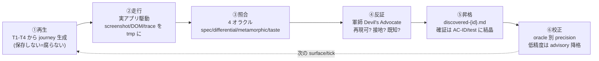

# 巡視 (じゅんし): 実装中・棚卸し時の挙動/視覚の発見を、人間のぽちぽち以上に (takumi 内部モード)

> [!NOTE]
> このファイルは takumi の **巡視 (junshi) エンジン** の人間向け LP です。独立した外部コマンドは存在せず、`/takumi` に「イシューだけ探して」(採取モード) や `/loop 30m /takumi 巡視` (常駐ループモード) のように伝えると起動します。AI runtime 仕様は `runtime.md` / `oracles.md` / `modes.md` / `graduation.md` を参照。**pilot-gated** (閾値先出し、`pilot.md`)。

計画になかった仕様変更・不具合・不自然さは、これまで人間がアプリをぽちぽち触って見つけていました。巡視は **アプリを実際に走らせて使い捨ての証拠を撮り、TopContract 由来のオラクルで照合** することで、その発見を機械化します。

```
/takumi イシューだけ洗い出して      ← 採取モード (探す→起票で止まる、直さない)
/loop 30m /takumi 巡視             ← 常駐ループモード (勝手に発火し続ける自己増殖発見)
```

---

## なぜ「スクショを撮る」だけでは 50 点なのか

人間がぽちぽちレビューで強いのは、目がいいからではなく **頭の中に「こうあるべき」という仕様モデルを持っていて、現実とのズレに気づくから**です。スクショは発見の**入力**であって、発見そのものではありません。

> [!IMPORTANT]
> 巡視の核心は capture (スクショ/e2e) ではなく **オラクル (何が正しいかを知っている装置) と校正ループ**です。takumi は他のどのワークフローも持っていない武器 — **TopContract (ドメイン不変条件 I1-I6 + ユーザータスク契約 T1-T4)** をすでに起草しています (`../contract/contract-spine.md`)。巡視はこれをオラクル源にし、発見を「なんとなく不自然」でなく **「派生した仕様への違反」** として接地します。これが人間を超える唯一の道です。

---

## 巡視エンジン (6 ステップ)



詳細は `runtime.md` (①-⑥ 手順)、`oracles.md` (4 オラクルの接地と昇格先)。

---

## 4 つのオラクル — 発見力の正体 (`oracles.md`)

| オラクル | 「正しい」の源 | 何を捕るか | 性質 |
|---|---|---|---|
| **仕様** (spec) | AC ← I/T 派生 (`../contract/contract-spine.md`) | 状態/出力が AC と食い違う | 客観 (gate 化候補) |
| **差分** (differential) | 前ビルド / 姉妹 surface / 参照実装 | AC で説明できない変化 = 回帰。**維持するベースライン不要** | 客観 (gate 化候補) |
| **変換不変** (metamorphic) | 変換不変条件 | 戻る→進むで元に戻るか / 同操作を 2 経路で同結果 / 並べ替えで同出力 | 客観 (gate 化候補) |
| **趣き** (taste) | ArtCoT rubric (`../design/taste-oracle.md`) | overlap/truncation/contrast/空・loading・error 状態の抜け | **主観 = advisory・never-block** |

仕様・差分・変換不変の 3 つが「人間のぽちぽち以上」の中核。趣きオラクルは taste-oracle の方針 (advisory・never-block・changed surface のみ) をそのまま継承します。

---

## 使い捨て ⇄ 永続の分離 (メンテが過酷にならない理由)

メンテ地獄の e2e suite の正体は「保存された壊れやすいスクリプト」です。巡視はそれを持ちません。

| 維持する (少数) | 毎回捨てる |
|---|---|
| TopContract specs (元々維持する) | journey (T1-T4 から毎回**再生成**) |
| 巡視エンジン (一度書く) | screenshot / DOM / trace (tmp、破棄) |
| graduate した少数の不変条件テスト (AC-ID / it()) | 摩擦ログの生データ |

> [!TIP]
> **使い捨ては探索、永続は確証 (=オラクルの結晶) だけ**。確証だけが verify L1 PBT / L3 differential / AC-ID に昇格し回帰保護になります (`graduation.md`)。保存される test スクリプトが存在しないので、spec が変われば journey は自動追従し、腐りようがありません。

---

## ユーザーニーズの発見 = 摩擦ログ (`oracles.md` §摩擦ログ)

「不具合」と「ユーザーニーズ」は別物です。違反していなくても**使いにくい**から。巡視は②走行中に **摩擦シグナル** (期待手数超のクリック / 行き止まり / 推測を強いられる / 操作後にフィードバック無し / アフォーダンス欠如) を別系統で記録し、`discovered-{id}.md` の `Friction/Need` カテゴリに流します。起票時の confidence は低め (人間/PM 判断を要する印) にして、バグ stream を汚しません。

---

## 2 モード

| モード | 発話例 | 動作 | 止まり方 |
|---|---|---|---|
| **採取 (discover-only)** | 「イシューだけ探して」「直さなくていいから洗い出して」「起票だけ」 | 巡視 → triage → 起票 | **起票で STOP** (実装しない) |
| **常駐ループ (auto-firing)** | `/loop 30m /takumi 巡視`、または実装中の per-Wave 自動発火 | 発見 → 自己増殖で plan 環流 → (autonomy に従い) 自動修正 → 繰り返す | 「止めて」or 限界効用 (`modes.md`) |

詳細・`/loop` 配線・autonomy 連携・排他ガードは `modes.md`。

---

## なぜ「人間以上」と言えるのか

- **機械の優位**: 全 behavioral surface を毎 Wave 網羅 (人間は飽きて飛ばす) / 疲れない / **TopContract 全不変条件を作業記憶に保持** (人間は I3・I5 を忘れる) / 前ビルドを正確に記憶 (差分オラクル)。
- **人間から借りるもの**: 意図・趣き → taste オラクル + 摩擦ログ。「本当に間違いか」の判断 → **仕様派生**が推測を消し、反証 (軍師) + 校正がノイズを消す。
- **結論**: 派生オラクルに接地し、誤検出を校正で統治して初めて人間を超える。**派生オラクル無しの巡視は人間より遥かに劣る (ノイズ製造機)**。

---

## 用語解説 (初めて聞く方へ)

| 用語 | 意味 |
|---|---|
| **巡視 (じゅんし)** | アプリを実際に走らせ、使い捨て証拠をオラクルで照合して発見する pass |
| **オラクル (oracle)** | 「期待される出力/状態」を提供する装置 (テスト工学用語) |
| **TopContract** | surface ごとのドメイン契約 (I1-I6 + T1-T4)、巡視のオラクル源 |
| **journey** | T1-T4 から生成されるユーザータスクの操作列。保存せず毎回再生成 |
| **使い捨て capture** | screenshot/DOM/trace を tmp に撮り、分析後に破棄する方式 |
| **昇格 (graduation)** | 確証された発見を AC-ID や verify test に結晶化すること |
| **摩擦ログ** | バグでないが使いにくい箇所 (= 潜在ニーズ) の記録 |
| **校正 (calibration)** | oracle 別の precision を測り、低精度を advisory に降格する学習ループ |
| **採取モード** | 探して起票で止まる discover-only モード |
| **常駐ループモード** | per-Wave / `/loop` で勝手に発火する自己増殖発見モード |

---

---

# AI runtime spec

runtime 手順 (①-⑥、Foreman 委譲、capture/破棄契約、停止) は `runtime.md`、4 オラクルの接地と昇格先は `oracles.md`、2 モードと `/loop` 配線は `modes.md`、確証の結晶化と校正 ledger は `graduation.md`、pilot 閾値は `pilot.md` を参照。
