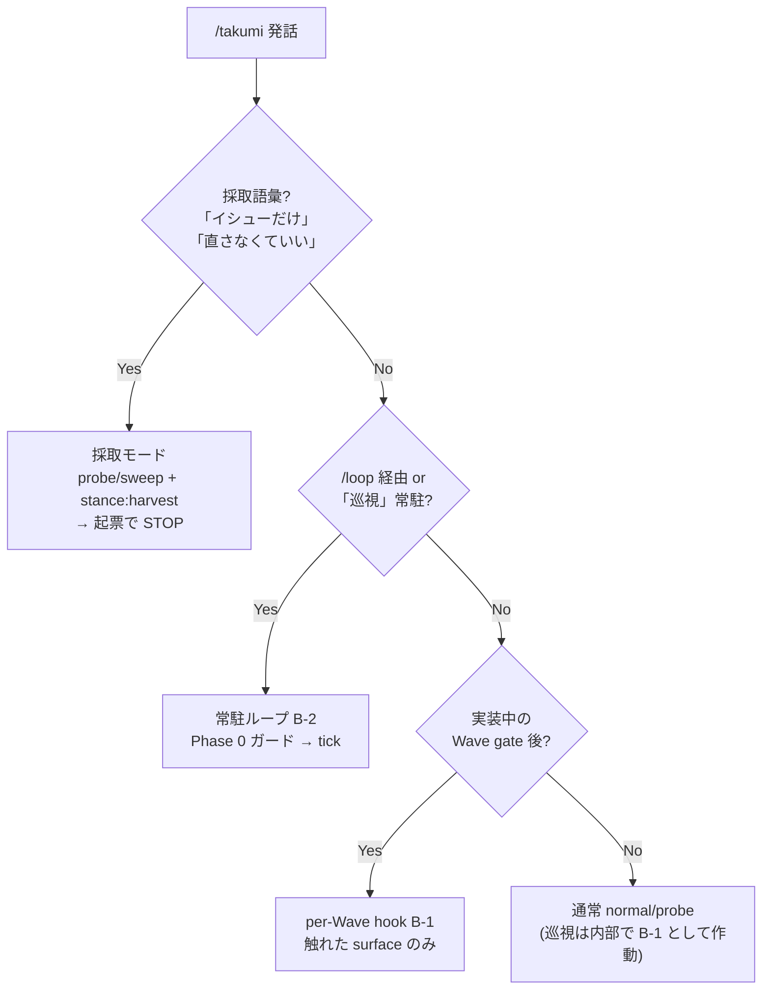

# 巡視の 2 モード — 採取 (discover-only) / 常駐ループ (auto-firing)

`runtime.md` のエンジンを 2 通りに消費する。**ユーザーが覚える入口は `/takumi` 1 つ** (自然文)。判定は `../natural-language.md` の語彙表。

| モード | 起動 | 動作 | 止まり方 |
|---|---|---|---|
| **採取 (discover-only)** | 「イシューだけ探して」「直さなくていいから洗い出して」「起票だけ」 | 巡視 → 発見 → triage → 起票 | **起票で STOP** (実装しない) |
| **常駐ループ (auto-firing)** | per-Wave gate 自動発火 / `/loop 30m /takumi 巡視` | 発見 → 自己増殖で plan 環流 → autonomy に従い自動修正 → 繰り返す | 「止めて」or 限界効用 |

---

## A. 採取モード (discover-only)

「探すだけ、直さない」。probe/sweep のフルサイクルから **計画+実行を切り離した stance**。

### 起動と stance
- 採取語彙 (上表) を検出 → probe mode (観点付き) / sweep mode (全般語) に遷移しつつ **`stance: harvest`** をセット
- probe なら `../probe/discover.md` の発見ラダーを回し、harness が揃えば **L6 (巡視)** まで登る
- sweep なら 8 次元 Discovery に巡視レンズを足す (`../sweep/quality-model.md`)

### 止まり方 (重要)
- triage (`../probe/triage.md`) まで実行し backlog.md を確定 → **`OfferPolicy.shouldOffer('probe_triage' | 'sweep_complete')`** で起票 (`../backlog/offer-policy.md`)
- **Phase 3 (計画) / Phase 4 (実行) に進まない**。「発見と起票で完了」をユーザーに報告して終了
- 新 OfferPolicy trigger は不要 (既存 trigger を再利用)

> 採取モードは `.takumi/` への書き込みのみ (specs/discoveries/backlog)。コード変更ゼロ = **ungated** (`../dispatch/autonomy.md` の discovery/backlog `.takumi/` 限定 ops は無ゲート)。最も安全なので pilot で先に回す (`pilot.md`)。

---

## B. 常駐ループモード (auto-firing self-multiplying)

「勝手に発火し続ける」。2 つの発火点を持つ。

### B-1. per-Wave gate hook (実装中に自動発火)

normal / probe / sprint の実装中、各 Wave gate (`../dispatch/executor.md` Step 1.5 / wave gate) の後に巡視を回す:

- 対象 = その Wave が **触れた behavioral surface** のみ (差分スコープ、全 surface を毎回見ない = コスト規律)
- harness + containment が揃えば②走行、無ければ静的縮退 (`runtime.md` 発火条件)
- 発見は `discovered-{id}.md` へ (self-multiplying)。**書き込みは `.takumi/` 限定 = ungated**
- 棟梁が Wave 境界で統合 → novel_valid を次バッチへ → 自己増殖が回る
- **コスト規律 (cadence)**: 軽い spec 照合 (diff × spec オラクル、アプリ起動なし) は毎 Wave。重い②走行 (実アプリ駆動 + 4 オラクル) は **定期点検 cadence (≈3 Wave ごと) + 高リスク/変更の大きい behavioral surface** に限定 (既存 executor Step 1.5 の自動点検/定期点検に整合、毎 Wave 全 surface を走らせない)

### B-2. `/loop` standalone (定期発火)

verify-loop と同じ `/loop` 配線で、実装と独立に定期巡視する:

```
/loop 30m /takumi 巡視
```

- `/loop` は Claude Code 組込 skill。30 分ごとに `/takumi 巡視` を tick 起動 (走行は重いので 10m でなく 30m 既定)
- 各 tick で **1 surface に集中** (verify-loop の 1 tick=1 file と同じ規律)。changed/hotspot surface 優先
- 全 behavioral surface が「2 tick 連続 novel_valid=0」で **watch モード**へ (verify-loop と同じ落ち着き方)。無限には回らない

### Phase 0 — 排他ガード (必ず最初、verify-loop と同型)

> [!WARNING]
> `.takumi/state.json` を読み、`status === "in_progress"` かつ `active_plan !== "junshi"` なら **即終了**。executor / verify-loop / sweep と同時に走るとプロジェクト状態と capture が壊れる。

| state | アクション |
|---|---|
| 他スキル `in_progress` | 即終了 (「{active} が実行中のためスキップ」) |
| `junshi` 自身 paused / completed / 無 | 続行 (paused は resume、completed は watch) |

### 自動修正 (発見 → 直す) の発火規律

常駐ループで発見を**直す**かは `../dispatch/autonomy.md` の `autonomy.level` に従う:

| level | 巡視発見の扱い |
|---|---|
| `manual` | 発見を backlog/plan に積むだけ。修正は人間着手 |
| `gated` | 計画 (G1) で人間承認 → 以降 Wave 自動 |
| `autonomous` (default) | 軍師 plan-review が blocking 無し AND critical AC 無し → 無人で修正 Wave 実行 |

- **修正の実行は必ず executor Wave gate (A-J) + human floor を経由** (`.takumi/`-only の発見とは別)。不可逆操作は §human floor で停止
- P0 発見は次バッチ先頭に割り込み (self-multiplying G5)
- **自動修正の対象は客観オラクル (spec / differential / metamorphic) のみ**。趣き/摩擦は never-block ゆえ**自動修正しない** (backlog 止まり、人間/PM 判断)。taste の `screenshot→critique→fix` 1 round は **design mode 内**の話で、巡視の自動修正とは別系統 (`oracles.md`)

---

## モード選択フロー (棟梁の判定)



---

## pilot gate (採用順序)

`pilot.md` の閾値を満たすまで build/gate に組み込まない (閾値先出し)。採用は安全な順:

1. **採取モード** (advisory・`.takumi/`-only) — 先行採用可 (低リスク)
2. **per-Wave hook B-1** の発見記録 (discovered-{id}.md まで) — 採取が pilot 通過後
3. **客観オラクルの gate 化** (spec/differential/metamorphic を G に寄せる) — pilot GO 必須
4. **常駐ループの自動修正 B-2** — autonomy + pilot GO 必須、趣きは恒久 advisory

### 2 knob: discovery (発見) と enforcement (強制) を分離

**発見の自己増殖と、発見を信じて gate/修正することは別物**。混同すると「未検証ゆえ全部 off」になり**自己増殖が死ぬ** (しかも pilot は発見を走らせないと precision を測れない = 走らぬものは検証不能)。よって 2 knob に分ける:

```yaml
junshi:
  discovery: auto      # auto (harness があれば既定) | manual | off
  enforcement: off     # off (既定) | gate | autofix   ← 上げるには pilot GO 必須
```

| knob / 値 | 効果 | リスク |
|---|---|---|
| `discovery: auto` (**harness 揃えば既定**) | per-Wave hook + 定期点検で巡視が発火し discovered-{id}.md に記録 → **自己増殖** (棟梁が計画に新タスク挿入)。advisory・`.takumi/`-only・可逆 | 低 (記録のみ、反証+triage を経て初めて backlog/draft AC) |
| `discovery: manual` | 採取モード等の明示発話でのみ起動 | なし |
| `discovery: off` | 巡視を完全停止 (harness 無 project の既定) | なし |
| `enforcement: gate` | 客観オラクル (spec/differential/metamorphic) が Wave gate を**ブロック**できる | 中 → **pilot GO 必須** |
| `enforcement: autofix` | 常駐ループ B-2 が発見を**自動修正** (executor gate + human floor 経由) | 高 → **pilot GO 必須** |

> [!IMPORTANT]
> **発見+自己増殖は安全 (advisory・可逆) なので harness があれば既定 ON** = 「複雑な計画の最中に勝手にイシューを見つけ、計画が育つ」動作。**pilot で gate するのは『発見を信じてブロック/修正する』enforcement だけ**。未検証の客観オラクルが緑のビルドを止めたり勝手に直したりするのを防ぐ。harness 無 / spec 無 project は `discovery: off` 相当で静かに skip (既存の静的自己増殖は従来通り動く)。

---

## 関連リソース

| file | 用途 |
|---|---|
| `runtime.md` (同) | ①-⑥ エンジン、Foreman 委譲、発火条件 |
| `oracles.md` (同) | 4 オラクル + 摩擦ログ |
| `graduation.md` (同) | 確証 → AC/verify、校正 ledger |
| `pilot.md` (同) | 閾値先出し、採用/棄却 |
| `../natural-language.md` | 巡視語彙 → モード振り分け |
| `../dispatch/autonomy.md` | autonomy.level、human floor、`.takumi/`-only ungated |
| `../dispatch/executor.md` | per-Wave hook (B-1) の挿入点、Wave gate A-J |
| `../verify-loop/runtime.md` | `/loop` + Phase 0 排他ガードの参照実装 |
