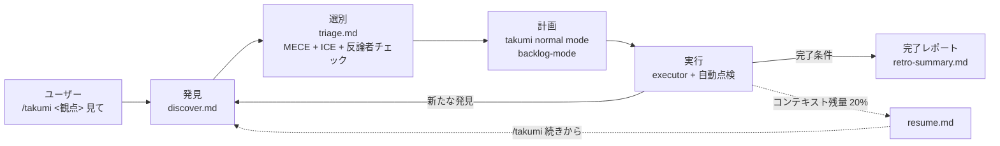

# probe mode: 観点を伝えるだけで、発見から修正まで自動で回る (takumi 内部モード)

> [!NOTE]
> このファイルは takumi の **probe mode** 内部 runtime doc です。独立した skill としての `/probe` コマンドは廃止され、`/takumi` に「security 見て」「パフォーマンス心配」等の観点発話を与えると、自然文インターフェース (`natural-language.md`) が probe mode に自動遷移します。人間が覚えるコマンドは `/takumi` 1 つだけ。本文中に残る `/probe ...` 形式の記述は runtime 手順上の擬似コマンド名であり、実際の人間向け入口ではありません。

「security が心配」「パフォーマンスどう?」のひとことで、調査から修正完了まで止まらず走り続けます。

```
/takumi security,パフォーマンス 見て
```

このひとことで、セキュリティとパフォーマンスの専門発見者が並列に走り、見つけた課題を重要度でソートし、修正計画を立て、実装して検証するまで**ユーザーが間に入ることなく**完走します。

---

## 目次

- [こんなお悩み、ありませんか?](#こんなお悩みありませんか)
- [ライフサイクル](#ライフサイクル)
- [probe が解決すること (5 つの視点)](#probe-が解決すること-5-つの視点)
  - [1. 観点を指定するだけで、専門の発見者が動きます](#1-観点を指定するだけで専門の発見者が動きます)
  - [2. 発見 → 選別 → 計画 → 実行 を 1 コマンドで連続実行](#2-発見--選別--計画--実行-を-1-コマンドで連続実行)
  - [3. 見つけた課題を、MECE に分類して ICE スコアで並べ替え](#3-見つけた課題をmece-に分類して-ice-スコアで並べ替え)
  - [4. 発見者の精度を、ループで学習していきます](#4-発見者の精度をループで学習していきます)
  - [5. 中断しても、再開できます](#5-中断しても再開できます)
- [用語解説 (初めて聞く方へ)](#用語解説-初めて聞く方へ)

---

## こんなお悩み、ありませんか?

> [!TIP]
> - セキュリティチェックをしたいが、何を見ればいいのかわからない
> - リリース前に「パフォーマンスは大丈夫?」と聞かれるが、手が回らない
> - アクセシビリティ診断を「やったほうがいい」と思いつつ後回しにしている
> - AI に調査を頼むと、調査結果を見た後に「じゃあ直して」と再依頼する必要がある
> - 部分的に直すと、他の似た箇所を見落としてしまう
> - 長時間の点検作業を、他の仕事をしながら裏で走らせたい

probe は、**観点を伝える → 発見 → 選別 → 計画 → 実行** までを 1 つのコマンドに統合し、**途中で人間が指示を出す必要がない**ように設計されています。

---

## ライフサイクル



---

## probe が解決すること (5 つの視点)

### 1. 観点を指定するだけで、専門の発見者が動きます

「このプロジェクトを全方位で見て」ではなく、**観点を絞ること**で発見の質が上がります。probe は以下の観点に対応しています。

| 観点 | 発見者が見ているもの |
|---|---|
| `security` | SQL インジェクション、権限昇格、CSRF、秘密鍵漏洩、SSRF |
| `パフォーマンス` / `perf` / `performance` | N+1 クエリ、不要な再レンダリング、メモリリーク、バンドルサイズ |
| `a11y` | WCAG 準拠、コントラスト、キーボード操作、スクリーンリーダー対応 |
| `ux` | 情報設計、導線、エラーハンドリング、空状態、ローディング体験 |
| `architecture` | 責務分離、循環依存、モジュール境界、プロトコル違反 |
| `quality` | テスト網羅、mutation score、エッジケース、不変条件 |
| `concurrency` | レースコンディション、デッドロック、リトライの冪等性 |

複数観点を同時指定できます (`/takumi security,パフォーマンス,a11y 見て`)。

### 2. 発見 → 選別 → 計画 → 実行 を 1 コマンドで連続実行

> [!IMPORTANT]
> AI に調査を依頼すると、大抵はこうなります。
>
> ```
> 1. 「〇〇について調査して」  → AI が調査結果を提示
> 2. 「全部直して」            → AI が修正コードを提示
> 3. 「テスト足りてる?」       → AI が追加テストを提示
> 4. 「Wave 分けて順に」        → AI が順序を提案
> ```
>
> 4 往復必要で、途中で気が散ると流れが止まります。probe mode はこれを 1 発話に統合します。
>
> ```
> /takumi security 見て  → 発見 → 選別 → 計画 → 実行 → (自動でループ)
> ```
>
> 各フェーズの切り目で進捗は報告されますが、**ユーザーの確認を待たずに自動で次に進みます**。「止めて」と言わない限り走り続けます。

### 3. 見つけた課題を、MECE に分類して ICE スコアで並べ替え

発見された課題をそのまま直すのは効率が悪く、優先順位を付ける必要があります。probe は 2 段階で選別します。

**MECE 分類** — 発見をダブりなく漏れなくカテゴライズ
- Bug / UX / Missing / Performance / Security / Accessibility / Architecture / DX

**ICE スコア** — 3 軸で定量評価し並べ替え
- **Impact** (影響度) — 直した時の効果の大きさ
- **Confidence** (確実性) — 本当に問題か、原因特定できているか
- **Ease** (容易性) — 直しやすさ

さらに**反論者チェック** — 軍師ロール (OpenAI GPT-5) が「これ本当に課題?」と敵対的に 1 件ずつ判定します。✅ (問題あり) / ⚠️ (要検討) / ❌ (却下) で振り分け、確実な ✅ だけが計画に進みます。

### 4. 発見者の精度を、ループで学習していきます

> [!NOTE]
> 発見者は 1 回きりではなく、**精度履歴**が付きます。「この発見者は前回 8 件発見して採用 6 件 (75%)」のような記録が `discovery-calibration.jsonl` に蓄積され、次回の重み付けに反映されます。精度が低い発見者は自動で除外提案されます。

### 5. 中断しても、再開できます

> [!TIP]
> 長時間の点検は途中で止まることがあります (コンテキスト上限、PC を閉じた、他の作業が入った)。probe mode は中断地点を `resume.md` に書き出し、`/takumi 続きから` (continue mode) で復元します。
>
> ```
> /takumi 続きから
> ```
>
> これだけで、前回の発見結果・選別結果・計画・Wave 進捗のすべてが復元されます。

---

## 用語解説 (初めて聞く方へ)

| 用語 | 意味 |
|---|---|
| **観点 (perspective)** | 「何を守りたいか」の切り口 (security / パフォーマンス / a11y など) |
| **発見者 (discoverer)** | 観点ごとに走る専門の調査エージェント |
| **MECE** | Mutually Exclusive, Collectively Exhaustive (ダブりなく漏れなく) の分類方針 |
| **ICE スコア** | Impact × Confidence × Ease の 3 軸評価 |
| **軍師 (反論者ロール)** | OpenAI GPT-5 (codex CLI)。Claude とは別系統のモデルで交差レビューする「反論者」 |
| **N+1 クエリ** | 1 件ごとに DB を叩いてしまうパフォーマンス問題 |
| **SSRF** | Server-Side Request Forgery。サーバから内部リソースを攻撃される脆弱性 |
| **CSRF** | Cross-Site Request Forgery。別サイト経由の不正リクエスト |
| **WCAG** | Web Content Accessibility Guidelines。アクセシビリティの国際基準 |
| **mutation score** | テストの鋭さを測る指標 (verify スキル参照) |
| **自己増殖型計画** | 実装中に発見された新たな課題が、自動的に計画に追記される方式 |
| **Foreman** | 全フェーズを丸ごと担当する代理エージェント。メイン会話のコンテキスト保護のため |

---

---

# AI runtime spec

Phase 0 委譲ガード、Phase 0a 初期化、Phase 1-4、再開、状態確認、終了条件、完了処理、制約は **`runtime.md`** に集約。このファイルは人間向け LP。
