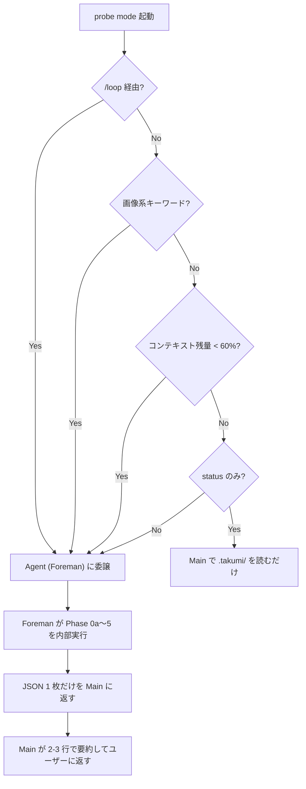

# probe mode — AI runtime spec

takumi の probe mode で呼び出された AI エージェントが Read する運用仕様。LP / 用語解説は `README.md` 側。

runtime 手順内に残る `/probe <観点>` 等の表記は擬似コマンド名であり、実際の人間向け入口ではない (入口は `/takumi` 1 つだけ)。

---

> ここから下は takumi の probe mode で呼び出された AI エージェントが Read する運用仕様です。Phase 0 委譲ガード、Phase 0a 初期化、Phase 1-4、再開、状態確認、終了条件、完了処理、制約を記述しています。内容は runtime で必要なため要約しません。runtime 手順内の `/probe <観点>` 等の表記は擬似コマンド名 (冒頭 NOTE 参照)。

---

指定された観点で 発見→選別→計画→実行 を1コマンドで起動し、止まらずに回し続ける。
自動点検・定期点検により走りながら品質をキャリブレーションする。

## 内部参照ファイル（このディレクトリ内）

| ファイル | 用途 | 読むタイミング |
|---------|------|--------------|
| `discover.md` | 発見フェーズの詳細手順 | Phase 1 |
| `triage.md` | 選別フェーズの詳細手順 | Phase 2 |

## runtime 内部モード

takumi の自然文インターフェース (`natural-language.md`) が以下の分岐を行う:

| 発話例 | 内部動作 |
|---|---|
| `/takumi <観点> 見て` (「〜心配」「〜調べて」等) | probe mode フルサイクル (発見 → 選別 → 計画 → 実行) |
| `/takumi 続きから` | continue mode 経由で probe mode を再開 |
| `/takumi 状態見せて` | status mode |

**観点の指定例:**
```
/takumi security,パフォーマンス 見て   ← セキュリティとパフォーマンスを調査
/takumi a11y 心配                      ← アクセシビリティだけ
/takumi ux と architecture 調べて      ← UX とアーキテクチャ
```

---

## フルサイクル (probe mode)

### Phase 0 — 委譲ガード（最優先・常に最初に判定）

> [!IMPORTANT]
> probe mode は重量オーケストレーターであり、全 Phase を Main の Opus 会話内で直接実行すると
> コンパクションが頻発する。以下のルールで **1 本の Agent (Foreman) に全 Phase を丸投げ**し、
> Main は最終 JSON サマリだけを受け取る。



委譲の起動条件 / 委譲手順 / Agent 委譲プロンプト本体 (JSON スキーマ含む) は **`delegation.md`** を参照。Mermaid の判定に合致したら delegation.md を読んで Agent を 1 本起動し、Main は戻り値 JSON を日本語で 2-3 行要約してユーザーに返すだけ。**以降の Phase 0a〜5 は Foreman (Agent) の内部手順**で Main では実行しない。

---

<details>
<summary><strong>Phase 0a — 初期化（Foreman 内で実行）</strong></summary>

### Phase 0a — 初期化（Foreman 内で実行）

1. `.takumi/sprints/` ディレクトリがなければ作成
2. 今日の日付で `.takumi/sprints/{日付}/` を作成
3. 前回プローブの状態を確認:
   - `.takumi/sprint-config.md` があれば読み込み（発見者精度の履歴）
   - 直近の `retro-summary.md` があれば読み込み（残課題・傾向）
4. ユーザーが指定した観点から発見者を選定（discover.md の Step 2 参照）

</details>

<details>
<summary><strong>Phase 1 — 発見フェーズ</strong></summary>

### Phase 1 — 発見フェーズ

同ディレクトリの `discover.md` を読み、手順を実行する。
ユーザー指定の観点に対応する発見者のみ起動する。

完了後、進捗を報告し**即座に Phase 2 へ進む**:
```
発見フェーズ完了: {N}件の課題を発見しました。→ 選別に進みます。
```

</details>

<details>
<summary><strong>Phase 2 — 選別フェーズ</strong></summary>

### Phase 2 — 選別フェーズ

同ディレクトリの `triage.md` を読み、手順を実行する。

完了後、進捗を報告し**即座に Phase 3 へ進む**:
```
選別フェーズ完了: {N}件を選出しました。→ 計画に進みます。
```

</details>

<details>
<summary><strong>Phase 3 — 計画フェーズ</strong></summary>

### Phase 3 — 計画フェーズ

`plan` スキルの **バックログ入力モード** (backlog-mode.md) で実行する。

1. backlog.md を読み込む
2. 各課題について plan がインタビューなしで Wave 計画を生成
   - 課題の証拠（file:line）があるため、斥候 調査は最小限
   - 依存関係のある課題は同一 Wave にまとめる
   - **自己増殖型** で計画を生成する（職人 の発見が次タスクになる）
3. 計画ファイル `.takumi/plans/probe-{日付}.md` を生成

計画生成後、進捗を報告し**即座に Phase 4 へ進む**:
```
計画生成完了: {Wave数} Wave、{タスク数} タスク → 実行に進みます。
```

</details>

<details>
<summary><strong>Phase 4 — 実行フェーズ（ここから止まらない）</strong></summary>

### Phase 4 — 実行フェーズ（ここから止まらない）

executor (takumi 内部ロール) が `probe-{日付}.md` の計画を Wave 順に実行する。

修正対象がテスト追加 / property 強化 / mutation score 向上を伴う場合は、
**verify 運用を内部呼び出し** する。verify の戦略選択フロー
(`../verify/README.md`) で適切な層 (L1-L6) を選んで適用する。
職人 タスクとして「verify L1 を src/lib/utils.ts に適用」のように具体化。テスト追加は `verify/spec-tests.md` の USS 原則 (1 unit = 1 test file、`it('{Subject} は {input} に対して {output} を返すべき')`) に従う。

executor が自動点検・定期点検を組み込んでいるため、
棟梁 は以下のサイクルで回り続ける:

```
Wave実行 → 自動点検（発見統合）→ Wave実行 → 自動点検 → Wave実行
→ 定期点検（発見者再実行+精度調整）→ Wave実行 → ...
→ 終了条件に到達 → 完了処理
```

</details>

---

<details>
<summary><strong>再開 (continue mode 経由で probe mode に再帰)</strong></summary>

## 再開 (continue mode 経由)

前回コンテキスト上限で中断した場合の再開手順 (ユーザー発話は `/takumi 続きから`):

1. `.takumi/sprints/` から最新の日付ディレクトリを探す
2. `resume.md` があれば読み込む
3. resume.md の内容に基づき、中断した Phase から再開:
   - 計画途中 → normal mode で計画生成を再実行
   - 実行途中 → executor を再開 (最初の `- [ ]` から)
   - 点検途中 → 点検を再実行してから実行再開
4. `resume.md` がなければ `.takumi/state.json` から状態を復元

</details>

---

<details>
<summary><strong>状態確認 (status mode で提示)</strong></summary>

## 状態確認 (status mode)

ユーザー発話 `/takumi 状態見せて` で status mode に遷移し、以下を提示する:

以下の情報を表示:

```markdown
## プローブ状態

### 現在のプローブ: {日付}
- フェーズ: {発見/選別/計画/実行}
- 観点: {ユーザーが指定した観点}
- 進捗: Wave {N}/{M}、タスク {完了数}/{全数}

### メトリクス推移
| 時点 | テスト数 | 型エラー | 修正済み | 残課題 |
|------|---------|---------|---------|--------|
| 開始時 | {N} | {N} | - | - |
| Wave 3後 | {N} | {N} | {N} | {N} |
| 現在 | {N} | {N} | {N} | {N} |

### 発見者精度（直近の定期点検）
| 発見者 | 発見数 | 採用数 | 精度 |
|--------|--------|--------|------|
| {名前} | {N} | {N} | {N}% |

### 自己増殖
- 職人発見による追加タスク: {N}件
- 定期点検による追加タスク: {N}件
```

</details>

---

<details>
<summary><strong>終了条件と完了処理</strong></summary>

## 終了条件と完了処理

### 自動終了条件

| 条件 | 判定方法 | アクション |
|------|---------|-----------|
| 完了 | バックログ空 + 新規発見なし + 自動点検で追加なし | 完了処理へ |
| 中断 | ユーザーが「止めて」 | 状態保存して終了 |
| 継続保存 | コンテキスト残量20% | resume.md 生成して終了 |

### 完了処理

1. 最終メトリクスを取得（テスト数、型エラー、git diff --stat）
2. プローブ全体のサマリを生成:

```markdown
# プローブ完了レポート: {日付}

## 結果
- 観点: {指定された観点}
- 実行タスク: {N}件（計画: {N} + 自己増殖: {N}）
- 修正課題: {N}件
- 新規テスト: {N}件

## メトリクス変化
| 指標 | 開始時 | 完了時 | 差分 |
|------|--------|--------|------|
| テスト通過数 | {N} | {N} | +{N} |
| 型エラー数 | {N} | {N} | -{N} |
| コード行数 | {N} | {N} | {±N} |

## 発見者精度（最終）
| 発見者 | 発見数 | 採用数 | 精度 | 次回推奨 |
|--------|--------|--------|------|---------|
| {名前} | {N} | {N} | {N}% | 維持/強化/除外 |

## 残課題（次回候補）
1. {課題} — 理由: {なぜ今回やらなかったか}

## 傾向
- {今回のプローブで見えたパターンや気づき}
```

3. `.takumi/sprint-config.md` を更新（発見者精度、推奨設定）
4. `.takumi/sprints/{日付}/retro-summary.md` に保存

### 継続保存（コンテキスト上限時）

```markdown
# 再開情報: {日付} {時刻}

## 中断地点
- 計画: .takumi/plans/probe-{日付}.md
- 完了Wave: {N}（タスク {N}件完了）
- 残Wave: {N}（タスク {N}件）
- 未処理の発見: {N}件（drafts/discovered-*.md）

## 直近の学び
{learnings.md の最新5件}

## 次にやるべきこと
1. {具体的な次のタスク}
2. {その次}

## 再開方法
/takumi 続きから (continue mode)
```

</details>

---

<details>
<summary><strong>制約</strong></summary>

## 制約

> [!WARNING]
> - 全フェーズを通して自動で回り続ける（ユーザーが「止めて」と言わない限り止まらない）
> - 各フェーズ完了時は進捗を報告するが、確認は求めず即座に次フェーズへ進む
> - コンテキスト上限が近づいたら必ず resume.md を生成してから終了する
> - sprint-config.md は上書きではなく履歴を追記する形式で管理する
> - **観点の指定は必須**。観点を含まない発話で probe mode に遷移しかけた場合は、利用可能な観点一覧を提示してユーザーに選ばせる

</details>
