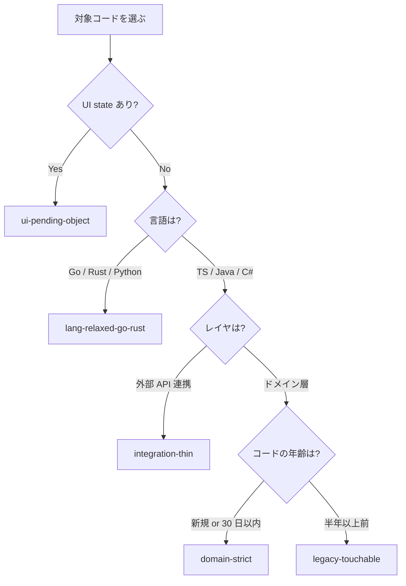
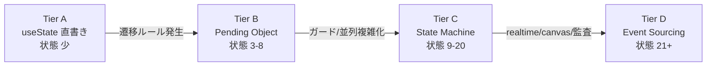

# strict-refactoring: 人類が積み上げてきた設計知見をチェックリスト化

<div align="center">


</div>

良い設計を、個人の経験ではなくルールとして再利用できるかたちに。

```
/takumi このサービスクラス、責務が多すぎる気がする
```

と話しかければ、このスキルが自動で起動します。**30 年かけてコミュニティが発見してきたベタープラクティス**を、プロジェクトの状況 (新規 / レガシー / 言語 / UI の有無) に応じて可変の強度で適用します。

---

## 目次

- [こんなお悩み、ありませんか?](#こんなお悩みありませんか)
- [strict-refactoring が解決すること (4 つの視点)](#strict-refactoring-が解決すること-4-つの視点)
  - [1. 30 年の知見を、5 つのプロファイルに整理](#1-30-年の知見を5-つのプロファイルに整理)
  - [2. 強度 (L1 / L2 / L3) を切り替えられます](#2-強度-l1--l2--l3-を切り替えられます)
  - [3. UI の状態管理が、自然にスケールします (Tier A→B→C→D)](#3-ui-の状態管理が自然にスケールします-tier-abcd)
  - [4. テスト (verify スキル) と、原理的にズレません](#4-テスト-verify-スキルと原理的にズレません)
- [用語解説 (初めて聞く方へ)](#用語解説-初めて聞く方へ)
- [以下、AI 実行時に参照する仕様](#以下ai-実行時に参照する仕様)

---

## こんなお悩み、ありませんか?

> [!TIP]
> 以下のような設計判断のブレ・迷いを、ルール化されたチェックリストに置き換えます。

- レビューで指摘される「設計」のコメントが人によって違う
- 「リファクタしたほうがいい」と言われるが、何をもって「良い」のかわからない
- OOP や DDD の本を読んだが、現場で使うと逆に不自然になる
- 新規コードには厳密なルールを、レガシーには緩いルールを適用したいが、線引きが曖昧
- 言語ごとにベストプラクティスが違う (Go と TypeScript では流儀が違う) のをどう扱うか

strict-refactoring は、**良い設計とされているパターンをルールとして成文化**し、適用強度を**プロファイル**で切り替える仕組みを提供します。

---

## strict-refactoring が解決すること (4 つの視点)

### 1. 30 年の知見を、5 つのプロファイルに整理

> [!NOTE]
> ソフトウェア設計の知見は、この数十年で膨大に積み上がってきました。以下はその主要な系譜です。

- **オブジェクト指向プログラミング (OOP)** — 1970 年代 Smalltalk から磨かれた、カプセル化・責務分離の考え方
- **関数型プログラミング (FP)** — 副作用を分離し、純粋関数を中心に置く考え方
- **ドメイン駆動設計 (DDD)** — 2003 年 Eric Evans の著書以降広まった、業務領域を中心に据える設計手法
- **CQRS (Command Query Responsibility Segregation)** — 状態を変える操作 (Command) と読む操作 (Query / ReadModel) を分離する考え方
- **Result 型** — 例外 (throw) ではなく、成功/失敗を型で表現するエラーハンドリング
- **Pending Object Pattern** — UI の中間状態を明示的にオブジェクト化し、validate してからコミットする手法

これらを「全部守れ」と言うと非現実的ですが、完全に無視すると何が良い設計かわからなくなります。strict-refactoring は 5 つのプロファイルに整理し、状況に応じて使い分けます。

> [!IMPORTANT]
> 全部守るのではなく、プロジェクトの状況に合った 1 つのプロファイルを選びます。

| プロファイル | 適用ケース |
|---|---|
| `domain-strict` | 新規ドメインロジック。Command / Pure / ReadModel で厳密に分類 |
| `ui-pending-object` | UI の状態あり。useReducer + actionPreconditions で安全性を担保 |
| `legacy-touchable` | 既存レガシーに最小侵襲。L1 の一部のみ warning として適用 |
| `integration-thin` | 外部 API 連携層。DTO 変換中心、ドメインルールは緩和 |
| `lang-relaxed-go-rust` | Go / Rust / Python。型システムで代替される制約は緩和 |



### 2. 強度 (L1 / L2 / L3) を切り替えられます

全ルールを常に適用するのではなく、3 段階の強度で段階的に導入できます。

> [!TIP]
> 新規ドメインコード → **L1+L2**、既存レガシーに 1 行足すだけ → **L1 のみ** (warning)、UI を組む → **L1+L2+L3** のように使い分けます。

- **L1 — 必須不変条件 (5 個)**: 新規コードなら絶対守る、基本中の基本
- **L2 — 既定ヒューリスティクス (14 個)**: 基本は守るが、状況により緩和可
- **L3 — UI state ルール**: React/Next.js の状態管理に特化した規則

### 3. UI の状態管理が、自然にスケールします (Tier A→B→C→D)

多くのプロジェクトで起こるのが、画面が複雑になるにつれて状態管理 (useState) がぐちゃぐちゃになる現象です。strict-refactoring は**成熟度の昇格階段**を用意しています。

| Tier | 本番設計 | いつ昇格するか |
|---|---|---|
| **A** | useState を直接書く | 状態数が少なく、関係も単純 |
| **B** | **Pending Object Pattern** (useReducer + 事前条件関数を export) | 状態 3-8、遷移にルールが必要になってきた |
| **C** | **State Machine** (XState で明示的な機械を作る) | 状態 9-20、並列状態やガードが複雑 |
| **D** | **Event Sourcing** (状態ではなくイベントを記録する) | 状態 21 以上、realtime / canvas / 監査 |



> [!IMPORTANT]
> **人間が昇格を決めなくても大丈夫です。** strict-refactoring が状態数・ガード数・並列性を測定し、「そろそろ B に昇格したほうがいいですね」と提案します。

### 4. テスト (verify スキル) と、原理的にズレません

一般的なプロジェクトでは、本番コードとテストコードが別々に書かれるため、**仕様解釈がズレる**という問題が起こります。リファクタすると両方直す必要があり、どちらかが古くなって「テストは通るがバグがある」状態に陥ります。

strict-refactoring は、姉妹スキル verify と**契約を共有**します。

| Tier | 本番側の契約 | verify がそれをどう使うか |
|---|---|---|
| A | Props 型 | Props arbitrary (ランダム生成) で component test |
| **B** | **`actionPreconditions` を export** | **そのまま fc.commands の precondition として再利用** |
| C | machine 定義 | そのまま `@xstate/test` で歩き回る |
| D | `applyEvent` pure 関数 | イベントの不変条件をテスト |

> [!IMPORTANT]
> 同じオブジェクトを本番とテストが**文字通り共有する**ので、drift が起こりようがない、というのがこのスキルの中核アイデアです。

---

## 用語解説 (初めて聞く方へ)

| 用語 | 意味 |
|---|---|
| **Command / Pure / ReadModel** | 操作の分類。状態を変える (Command)、副作用なし (Pure)、状態を読む (ReadModel) |
| **完全コンストラクタ** | オブジェクトを作った瞬間に必ず有効な状態である、という原則 |
| **イミュータブル** | 一度作ったオブジェクトを書き換えず、新しいオブジェクトを返す方針 |
| **Result 型** | 成功/失敗を型で表現 (`Result<T, E>`)。例外投げずにエラーを返す |
| **Early Return** | 条件を満たさないケースを関数の冒頭で return、ネストを浅くする |
| **Pending Object Pattern** | 変更を「保留オブジェクト」に集めて validate してからコミットする設計 |
| **useReducer** | React で状態遷移を reducer 関数に切り出すフック |
| **Aggregate Root** | DDD で、関連オブジェクト群の一貫性を守る代表オブジェクト |
| **Primitive Obsession** | プリミティブ型 (string, number) を使いすぎて意味が不明瞭になる状態 |
| **DTO (Data Transfer Object)** | 外部 API との境界でデータを運ぶためだけのオブジェクト |

---

---

# AI runtime guide

When To Use / Workflow / Profile Selection / Required Invariants / Standard Heuristics / UI State Rules / Verify Contracts / Output Expectations / 制約 / 関連リソースは **`guide.md`** に集約。このファイルは人間向け LP。
