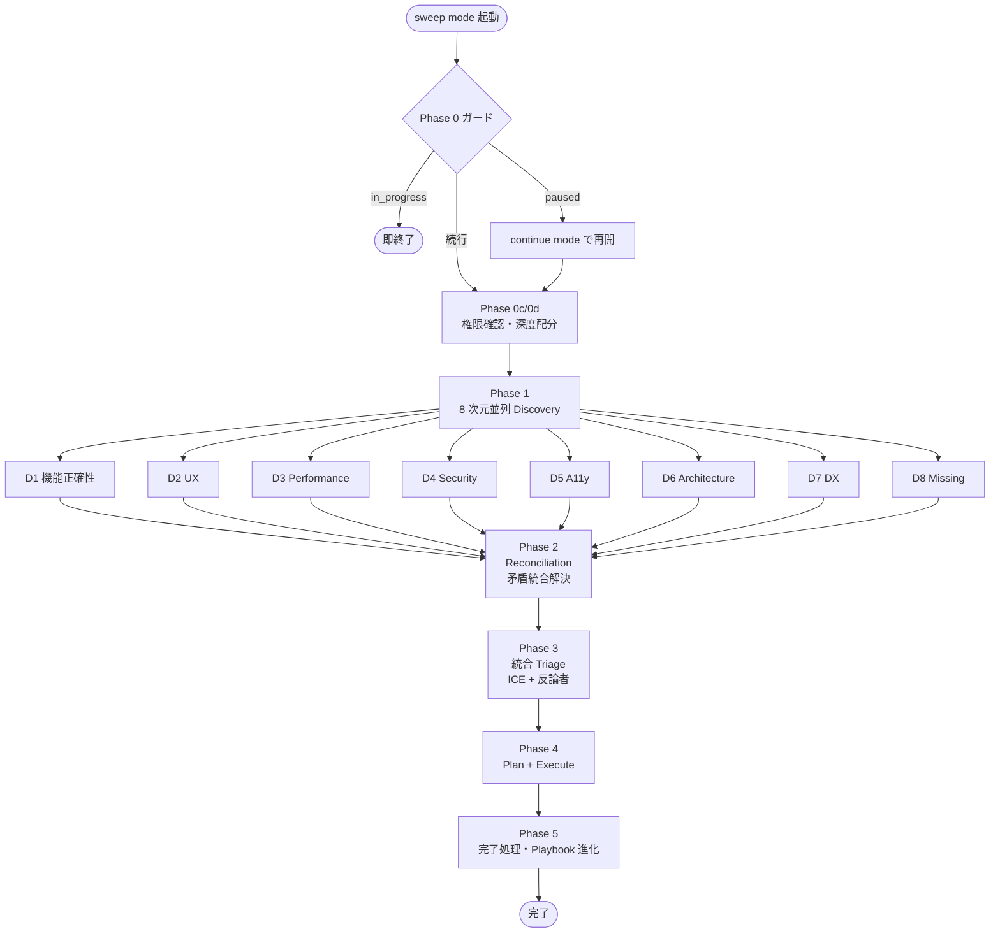
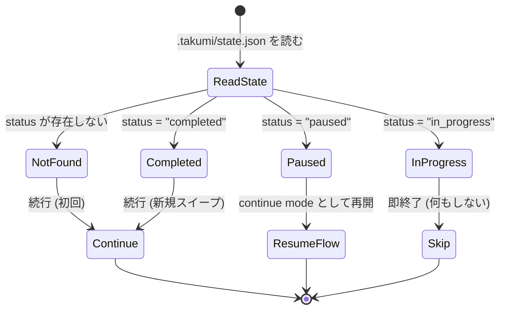

# sweep mode: リリース前の総点検を、1 つの発話で (takumi 内部モード)

> [!NOTE]
> このファイルは takumi の **sweep mode** 内部 runtime doc です。独立した skill としての `/sweep` コマンドは廃止され、`/takumi` に「全般的に棚卸し」「リリース前にちゃんと見て」「総点検して」等の全般語発話を与えると、自然文インターフェース (`natural-language.md`) が sweep mode に自動遷移します。人間が覚えるコマンドは `/takumi` 1 つだけ。本文中に残る `/sweep ...` 形式の記述は runtime 手順上の擬似コマンド名であり、実際の人間向け入口ではありません。

観点を 1 つに絞らず、**全方位で同時に** プロジェクトを点検します。

```
/takumi リリース前に全部見て
```

機能正確性、UX、パフォーマンス、セキュリティ、アクセシビリティ、アーキテクチャ、DX、欠落機能 — 8 つの品質次元を**並列に**調査し、**矛盾する改善提案を両立する解決案**に統合してから、計画を立てて実行します。

---

## 目次

- [こんなお悩み、ありませんか?](#こんなお悩みありませんか)
- [sweep が解決すること (5 つの視点)](#sweep-が解決すること-5-つの視点)
  - [1. 8 つの品質次元を、並列に同時調査](#1-8-つの品質次元を並列に同時調査)
  - [2. 次元ごとに深度を自動配分します](#2-次元ごとに深度を自動配分します)
  - [3. 矛盾する改善提案を、統合で解決します (ここが sweep の核)](#3-矛盾する改善提案を統合で解決します-ここが-sweep-の核)
  - [4. Playbook が進化していきます](#4-playbook-が進化していきます)
  - [5. 中断しても、再開できます](#5-中断しても再開できます)
- [フロー (8 次元並列発見 → 統合 → Triage → Plan → Execute)](#フロー-8-次元並列発見--統合--triage--plan--execute)
- [Phase 0 ガードの分岐](#phase-0-ガードの分岐)
- [用語解説 (初めて聞く方へ)](#用語解説-初めて聞く方へ)
- [AI 実行時に参照する仕様](#以下ai-実行時に参照する仕様)

---

## こんなお悩み、ありませんか?

> [!TIP]
> - リリース前に総点検したいが、全部見て回る時間がない
> - 観点ごとに別々のレビューをすると、提案が矛盾して困る (「パフォーマンス優先」vs「可読性優先」など)
> - 漏れなく見たいのに、指示する観点を忘れがち
> - 大きなリファクタ前に「何を直すべきか」の全体像がほしい
> - 定期的に棚卸しをしたいが、ルーチンとして組み込めていない

> [!IMPORTANT]
> sweep は、**観点指定不要で全方位を同時にカバー**し、**矛盾した提案を統合**してから実行する、リリース前の総点検スキルです。

---

## sweep が解決すること (5 つの視点)

### 1. 8 つの品質次元を、並列に同時調査

sweep は以下の 8 次元を自動で走査します。ユーザーは「観点」を指定する必要がありません。

| 次元 | 内容 |
|---|---|
| **D1. 機能正確性** | 仕様との整合、バグ、エッジケース |
| **D2. UX** | 導線、エラー体験、空状態、情報設計 |
| **D3. パフォーマンス** | N+1、再レンダリング、バンドル、クリティカルパス |
| **D4. セキュリティ** | 認可、入力検証、シークレット管理、依存脆弱性 |
| **D5. アクセシビリティ** | WCAG、キーボード、スクリーンリーダー、コントラスト |
| **D6. アーキテクチャ** | 責務分離、循環依存、モジュール境界 |
| **D7. DX (開発体験)** | ビルド速度、テスト体験、エラーメッセージ |
| **D8. 欠落機能** | 仕様は要求しているが未実装、運用に必要だが未整備 |

各次元には独立した発見者 (Haiku ベース) が割り当てられ、**並列に**走ります。逐次だと数十分かかる調査が、並列化で大幅に短縮されます。

### 2. 次元ごとに深度を自動配分します

全次元を等しく深く掘るのは無駄です。sweep は直近の git 履歴、テスト結果、過去の点検結果から、今回掘るべき深度を自動配分します。

| 深度 | 動き |
|---|---|
| **DEEP** | 30+ 件の発見を狙う。ホットスポットを徹底調査 |
| **STANDARD** | 10-20 件。通常の調査 |
| **SCAN** | 5 件以下。軽い見回り |
| **SKIP** | 前回点検で卒業済みなど、今回は省略 |

**直近でバグが頻発している次元は DEEP、安定している次元は SCAN**、のように知的に配分されます。

### 3. 矛盾する改善提案を、統合で解決します (ここが sweep の核)

全次元を同時に見ると、**逆方向の提案**がよく出ます。

- D2 (UX): 「情報量を増やして、ダッシュボードを充実させたい」
- D3 (Performance): 「ダッシュボードの初期表示を速くしたい (情報を減らしたい)」

> [!IMPORTANT]
> こういった**矛盾ペア**を sweep は機械的に検出し、両立する解決案 (= 統合解) を生成します。たとえば「重要な情報を初期表示し、残りはタブまたは遅延ロードで出す」のような第三の案です。

統合解は以下の手順で導出されます。

1. 矛盾ペアを検出 (`conflicts.md` に出力)
2. `integration-playbook.md` に記載された**過去の統合パターン**を参照
3. 軍師 (OpenAI GPT-5) に「これは本物の統合か? 第 3 次元を犠牲にしていないか?」と検証を依頼
4. 合格した統合案のみ `resolved-backlog.md` に採用

### 4. Playbook が進化していきます

> [!NOTE]
> 過去の点検で使った統合パターンは `integration-playbook.md` に蓄積されます。
>
> - 「UX vs Perf の矛盾 → Progressive Disclosure で両立」
> - 「Security vs DX の矛盾 → 開発環境だけ緩める feature flag」
> - 「Architecture vs Velocity の矛盾 → 期限付きの技術債務記録」
>
> **回数を重ねるごとに、統合の手札が増えていきます**。

### 5. 中断しても、再開できます

> [!TIP]
> sweep mode も probe mode と同じく長時間実行されます。コンテキスト上限、PC 終了、他の作業割り込み — いずれの理由でも `resume.md` に中断情報が書き出され、`/takumi 続きから` で sweep mode が continue mode 経由で再開されます。

---

## フロー (8 次元並列発見 → 統合 → Triage → Plan → Execute)



---

## Phase 0 ガードの分岐



---

## 用語解説 (初めて聞く方へ)

| 用語 | 意味 |
|---|---|
| **品質次元 (Quality Dimension)** | 品質を評価する独立した観点 (D1-D8 の 8 軸) |
| **MECE** | Mutually Exclusive, Collectively Exhaustive。ダブりなく漏れなく分類する方針 |
| **統合 (Integration / Synthesis)** | 矛盾する 2 提案を両立させる第 3 の解決案 |
| **Playbook** | 過去の統合パターン集。経験を蓄積する台帳 |
| **深度配分 (Depth Allocation)** | 次元ごとに掘る深さを変える戦略 |
| **ホットスポット** | 最近の変更が集中しているファイル。バグが潜みやすい |
| **ICE スコア** | Impact x Confidence x Ease の 3 軸評価 |
| **反論者チェック** | 軍師 (別 AI モデル) による敵対的判定 |
| **卒業 (Graduation)** | 特定次元 x 画面の組で、点検が不要なレベルに達した状態 |
| **Foreman** | 全フェーズを丸ごと担当する代理エージェント (コンテキスト保護目的) |

---

---

# AI runtime spec

N 次元並列発見 → Reconciliation → Triage → Plan+Execute → 完了処理 の各 Phase 詳細、委譲手順、制約は **`runtime.md`** に集約。このファイルは人間向け LP。
