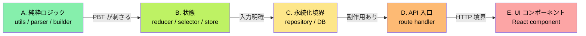
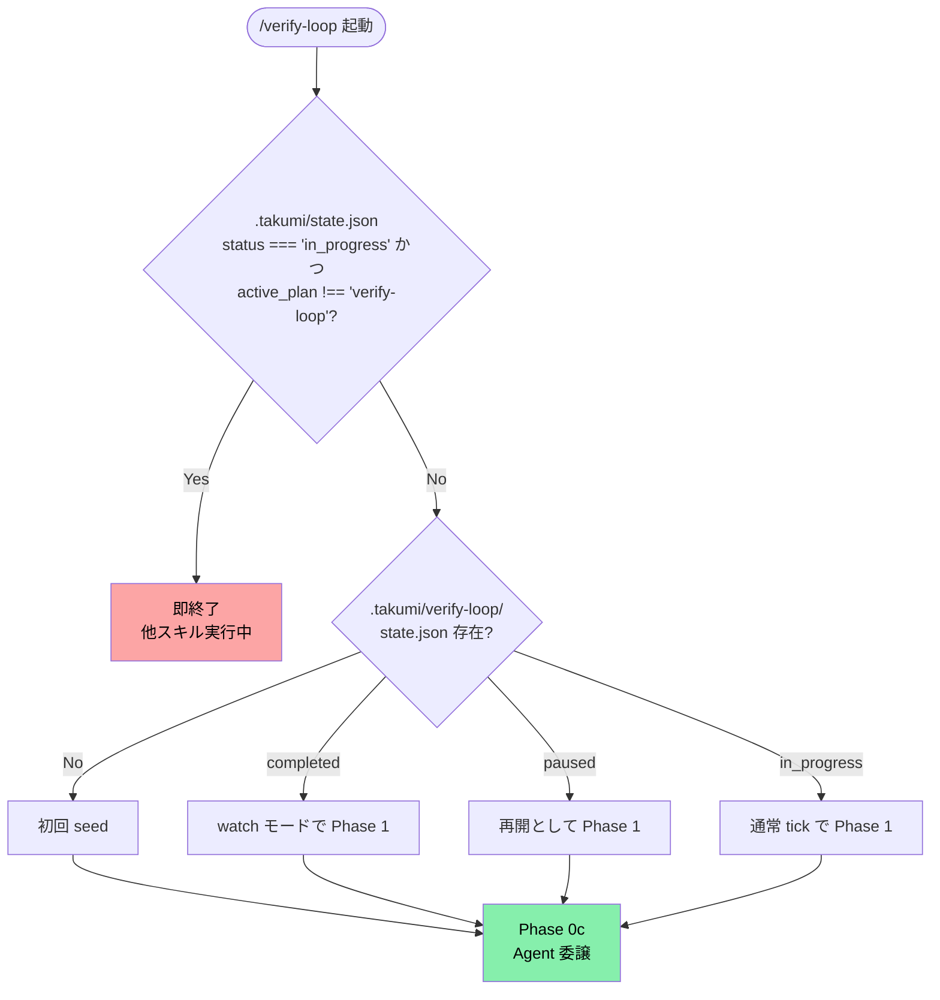

# verify-loop: 寝ている間も、テストが鋭くなり続ける

<p align="center">
  
  
  
</p>

テストの質を機械的に測る指標 **mutation score** を、各レイヤーで 80% 以上に積み上げる**長時間ループスキル**です。

```
/loop 10m /verify-loop
```

10 分ごとに自動起動し、1 つのファイルに集中して、「テストの抜け穴」を塞いでいきます。純粋ロジック層 (A) から順に攻略し、全部で 5 層 (A→B→C→D→E) を走破します。

---

## 目次

- [こんなお悩み、ありませんか?](#こんなお悩みありませんか)
- [verify-loop が解決すること (5 つの視点)](#verify-loop-が解決すること-5-つの視点)
  - [1. レイヤー順に攻略します (A→B→C→D→E)](#1-レイヤー順に攻略します-abcde)
  - [2. 毎回、違う「目線」で攻めます (Tabu + Finder Rotation)](#2-毎回違う目線で攻めます-tabu--finder-rotation)
  - [3. Stryker incremental で、待ち時間を最小化](#3-stryker-incremental-で待ち時間を最小化)
  - [4. レイヤー卒業後は watch モードへ](#4-レイヤー卒業後は-watch-モードへ)
  - [5. 他のループと競合しません](#5-他のループと競合しません)
- [用語解説 (初めて聞く方へ)](#用語解説-初めて聞く方へ)
- [以下、AI 実行時に参照する仕様](#以下ai-実行時に参照する仕様)

---

## こんなお悩み、ありませんか?

> [!TIP]
> **verify-loop は、こういう悩みを 10 分間隔のループで少しずつ解消します。**

- カバレッジ 80% を達成したのに、本番バグが出る
- mutation score が低いことはわかるが、どこから手を付けていいかわからない
- テストを網羅的に書く時間が取れない
- 大量のファイルがあって、全部にテストを足すのは現実的でない
- 「テストの弱いファイル」を特定する仕組みがない
- AI に何度も「テスト足して」と依頼するのが手間

> [!IMPORTANT]
> **1 tick = 1 ファイル集中**で着実にテストを鋭くしていく、長時間運用用のループスキルです。寝ている間、会議中、他の作業をしている間にも、バックグラウンドで品質が積み上がっていきます。

---

## verify-loop が解決すること (5 つの視点)

### 1. レイヤー順に攻略します (A→B→C→D→E)

すべてのファイルに同時にテストを足すのは現実的ではありません。verify-loop はファイルを 5 つのレイヤーに分け、順に攻略します。



| レイヤー | 内容 | なぜこの順番か |
|---|---|---|
| **A. 純粋ロジック** | utils、parser、builder など | 入出力が明確で PBT が刺さりやすい。早く 80% 到達する |
| **B. 状態** | reducer、selector、store | 入力 (state + action) が明確で次に攻略しやすい |
| **C. 永続化境界** | repository、DB アクセス層 | 副作用あり、テストは重いが確実な層 |
| **D. API 入口** | route handler、endpoint | 外部との境界。HTTP を含むと遅いので後回し |
| **E. UI コンポーネント** | React コンポーネント | DOM / 非同期を含む。最難関なので最後 |

**変異の検知しやすさが高い順**という科学的根拠に基づいた順序です。早く勝てる層から片付け、心理的な勝ち筋を作ります。

### 2. 毎回、違う「目線」で攻めます (Tabu + Finder Rotation)

同じファイルに繰り返しテストを足すと、同じ観点のテストばかり増えて意味がありません。verify-loop は**禁じ手 (tabu) リスト**と**発見者のローテーション**を持っています。

発見者 (finder) は以下のカテゴリを巡回します:

- 算術境界 (`arithmetic_boundary`) — `>` vs `>=`、off-by-one
- 空配列 (`empty_array`) — 空入力での挙動
- null 境界 (`null_boundary`) — null / undefined の扱い
- 否定条件 (`negated_condition`) — `if (!x)` の反転
- 演算子入れ替え (`operator_swap`) — `&&` と `||`、`+` と `-`
- ループ境界 (`loop_boundary`) — off-by-one、空ループ
- ... (他多数)

> [!NOTE]
> **直近 2-3 tick で使った finder は禁じ手**として除外し、必ず違う観点で攻めます。これにより、同じファイルを何度訪れても新しい観点のテストが追加されます。

### 3. Stryker incremental で、待ち時間を最小化

mutation testing は重い処理 (数分〜数時間) ですが、verify-loop は Stryker の **incremental モード**を使って差分だけを測ります。

```bash
pnpm stryker run --incremental --mutate <file>
```

1 tick あたり 1 ファイル、20-40 秒で完了します。10 分間隔のループなら、**1 ファイルあたり大量の tick を費やせる**ペースです。

### 4. レイヤー卒業後は watch モードへ

> [!TIP]
> 全 5 レイヤーで 80% を達成したら、verify-loop は**watch モード**に移行します。通常は休眠し、変更があったファイルだけ再測定します。

**無限に動き続けるわけではない** — 目標を達成したら落ち着くのも、このスキルの大事な特性です。

### 5. 他のループと競合しません

複数のループ (sweep、verify-loop、その他) を同時に `/loop` 登録すると、同じプロジェクトで同時に走ってぶつかります。verify-loop は `.takumi/state.json` を見て、**他のスキルが in_progress なら即終了**します。安全に並べて登録できます。

---

## 用語解説 (初めて聞く方へ)

| 用語 | 意味 |
|---|---|
| **mutation score** | 意図的に植えたバグをテストが検知した割合。テストの鋭さを示す |
| **Stryker** | JavaScript/TypeScript 向け mutation testing ツール |
| **incremental** | 全体ではなく差分だけを測定するモード |
| **survived mutant** | 植えられたバグのうち、テストが検知できなかったもの |
| **tick** | ループの 1 回分の実行単位 |
| **tabu リスト** | 直近で使った観点を一時的に除外するリスト |
| **finder** | 「どういう観点でバグを探すか」のパターン (境界値、null、否定、など) |
| **layer graduation** | あるレイヤーの全ファイルが目標 mutation score に到達した状態 |
| **watch モード** | 新規変更のあったファイルだけ再測定する、静的な監視状態 |
| **Foreman** | tick を丸ごと担当する代理エージェント (コンテキスト保護) |
| **AST** | 抽象構文木。コードを木構造として解析したもの |
| **layer** | verify-loop でファイルを分ける論理的なグループ (A〜E の 5 段階) |

---

# 以下、AI 実行時に参照する仕様

> [!NOTE]
> ここから下は `/verify-loop` を実行した AI エージェントが読む仕様セクションです。人間の読者はここで読み終えて OK。

---

`/loop 10m /verify-loop` のように Claude Code の `/loop` スキルから呼び出す、
**継続テスト拡充スキル**。各 tick で 1 ファイルに集中して:

1. Stryker incremental で survived mutant を検出
2. tabu 観点を避けつつ finder (arithmetic_boundary / empty_array / null_boundary / ...) を 1 つ選択
3. Property test / example test を 1-3 本追加
4. 必要に応じて実装バグを修正
5. score を state.json に記録

現在の layer 全員が 80% 以上に到達したら次の layer へ進む。全 layer 完了後は watch モード
(変更ファイルのみ再測定)。

## 本体ドキュメント

詳細な手順・状態ファイル形式・Phase 定義は **`~/.claude/skills/takumi/verify/loop.md`** に集約。
このファイルはエントリーポイントとループガードのみ。

## 使い方

| コマンド | 動作 |
|---------|------|
| `/verify-loop` | 1 tick 実行 (現在の layer / 対象ファイルから自動選択) |
| `/verify-loop continue` | paused 状態から再開 |
| `/verify-loop status` | state.json の要約を表示 |
| `/loop 10m /verify-loop` | 10 分間隔で自動 tick (Claude Code の /loop 経由) |

## Phase 0 — ガード (必ず最初に実行)



### 0a. 他スキルとの競合回避

> [!WARNING]
> `.takumi/state.json` を読み、`status === "in_progress"` かつ `active_plan !== "verify-loop"` なら**即終了**する。他のスキルと同時実行するとプロジェクト状態が壊れる。

`.takumi/state.json` を読む:
- `status === "in_progress"` かつ `active_plan !== "verify-loop"` → **即終了**。
  「他のスキル ({active_plan}) が実行中のためスキップします」と報告して何もしない
- 上記以外 → 続行

### 0b. state.json の存在確認

`.takumi/verify-loop/state.json` を確認:
- 存在しない → **初回 seed** を実行 (後述)
- 存在する `status === "completed"` → **watch モード**で Phase 1 へ (変更ファイル検出のみ)
- 存在する `status === "paused"` → 再開として Phase 1 へ
- 存在する `status === "in_progress"` → 通常 tick として Phase 1 へ

### 0c. Agent 委譲 (必須)

tick 内で Stryker 実行 + mutant 分析 + test 追加 + 検証と context を大量消費するため、
**必ず Agent ツールに委譲する**。Main は Agent の JSON 応答だけを受ける。

<details>
<summary><b>Agent 委譲プロンプト (クリックで展開)</b></summary>

```
Agent(
  description: "verify-loop tick {N}",
  subagent_type: "general-purpose",
  prompt: """
    Read ~/.claude/skills/takumi/verify/loop.md fully and execute Phase 1-6.
    Read CLAUDE.md for the project context.
    Read .takumi/verify-loop/state.json for current state.

    ## I/O 契約 (厳守)
    - Stryker report は .takumi/verify-loop/reports/{tick_n}/{safe_path}.json に保存
    - state.json の書き換えは *.partial → mv *.final (atomic)
    - 最終メッセージは JSON 1 枚のみ (1KB 未満、画像・diff 含めない):
      {
        "tick": N,
        "layer": "A",
        "file": "src/lib/...",
        "before_score": N,
        "after_score": N,
        "finder_used": "arithmetic_boundary",
        "action_taken": "added 2 PBT for boundary values",
        "layer_graduated": false,
        "next_layer": "A",
        "status": "in_progress | paused | completed | watch",
        "one_line_verdict": "..."
      }

    ## 親に返してはいけないもの
    - Stryker html 本文 / 長い survivor 列挙
    - 追加した test コードの本文 (diff)
    - 修正した実装の本文 (diff)
    これらは全て .takumi/verify-loop/ 配下にのみ書く。

    ## コンテキスト保護
    残量 20% を切ったら state.json を保存し、resume.md を書き、status: "paused" で早期終了。
  """,
  run_in_background: false
)
```

</details>

<details>
<summary><b>Phase 1 以降の 6 phase 詳細 (クリックで展開)</b></summary>

Agent 内で実行される (Main では実行しない)。詳細は `~/.claude/skills/takumi/verify/loop.md`:

1. **Phase 1**: 対象ファイル選択 (tabu と被らない `active`/`pending` から best_score 昇順)
2. **Phase 2**: `pnpm stryker run --incremental --mutate <file>` で survived mutant 抽出
3. **Phase 3**: finder 選択 (tabu に 3 tick 追加) → test 追加 → 必要なら実装修正
4. **Phase 4**: state.json 更新 + layer graduation 判定
5. **Phase 5**: 全 layer 完了なら watch モード移行 (変更ファイル再測定のみ)
6. **Phase 6**: context 残量切迫時の paused 保存

</details>

<details>
<summary><b>初回 seed 手順 (クリックで展開)</b></summary>

state.json が無い時は、`seed-state.md` (同ディレクトリ内) の手順で生成:

1. project のディレクトリを glob で走査
2. 5 layer に振り分け:
   - **A 純粋ロジック**: `src/lib/**/*.ts` (テスト除外), `src/features/*/utils/**/*.ts`
   - **B 状態**: `src/features/*/store/**/*.ts`, `src/features/*/hooks/**/use-*.ts` の reducer/selector
   - **C 永続化境界**: `src/features/*/actions/**-repository.ts`, `src/lib/db/**/*.ts`
   - **D API 入口**: `src/app/api/**/route.ts`
   - **E UI component**: `src/features/*/components/**/*.tsx`
3. 各ファイルを `{path, status: 'pending', best_score: 0, tick_count: 0, ...}` で列挙
4. `current_layer = 'A'`, `layer_order = ['A','B','C','D','E']`, `status = 'in_progress'` で書き出し

</details>

<details>
<summary><b>制約 (クリックで展開)</b></summary>

> [!WARNING]
> 以下の制約は厳守。無視すると context 崩壊・state 壊滅・人間レビュー工数爆発のいずれかが起こる。

- 1 tick = 1 ファイル集中。複数ファイル並列禁止 (context と Stryker 待ちで崩壊)
- Full stryker run は layer graduation 時のみ
- tabu_patterns を無視しない (直近 2-3 tick の観点は除外)
- 実装バグ修正は mutant が「仕様違反」を示す時のみ、それ以外は `discovered-*.md` に落として人間レビュー
- state.json の手動書き換え禁止 (Phase 4 経路のみ)
- stryker html を親に返さない (要約 JSON のみ)
- 1 file の `tick_count > 8` で 80% 未到達なら `skipped_difficult` としてフラグ立てて人間判断へ

</details>

<details>
<summary><b>設計根拠 (クリックで展開)</b></summary>

軍師 (gpt-5.4) との相談結果:

- **レイヤー順 A→E** は mutant kill 難度の低い順。A は入出力明確で PBT が刺さる → 早く 80% 到達 → E (DOM/非同期) は最後に回す
- **file-within-layer の state 管理**: layer 単位の graduation 判定と、個別 file の tick history を両立
- **tabu + finder rotation**: 「同じ観点を繰り返さない」を構造的に保証。直近 2-3 tick で使った finder は tabu、新 tick は別カテゴリから選ぶ
- **incremental mutate**: 1 tick 10 分は 1 ファイル (`--mutate <file>`) が現実的。複数ファイルは待ち時間で崩れる

関連スキル:
- `~/.claude/skills/takumi/verify/README.md` — 検証全体方針
- `~/.claude/skills/takumi/verify/mutation.md` — Stryker 設定詳細
- `~/.claude/skills/takumi/sweep/README.md` — 同系統のループ対応オーケストレーター (参考)

</details>
