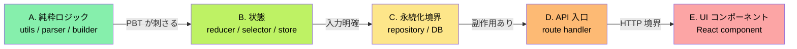

# verify-loop: 寝ている間も、テストが鋭くなり続ける

<p align="center">
  
  
  
</p>

テストの質を機械的に測る指標 **mutation score** を、各レイヤーで 80% 以上に積み上げる**長時間ループスキル**です。

```
/loop 10m /verify-loop
```

10 分ごとに自動起動し、1 つのファイルに集中して、「テストの抜け穴」を塞いでいきます。純粋ロジック層 (A) から順に攻略し、全部で 5 層 (A→B→C→D→E) を走破します。

> [!IMPORTANT]
> verify-loop は tick 毎に mutation testing ツールの incremental 実行を前提とするため、**project 言語が L4 primary tier である必要があります** — 具体的には JS/TS (Stryker-JS) / Java/Kotlin (PIT) / C# (Stryker.NET) / Rust (cargo-mutants, `--in-diff` 必須) / Scala (Stryker4s) のいずれか。Python / Go は advisory tier (operator 覆盖が Stryker レベルに到達していない) のため verify-loop の対象外となります。その場合は L1 PBT の拡充ループを別途検討してください。tier 定義は `../verify/mutation.md` 「対応言語と tier」を参照。

---

## 目次

- [こんなお悩み、ありませんか?](#こんなお悩みありませんか)
- [verify-loop が解決すること (5 つの視点)](#verify-loop-が解決すること-5-つの視点)
  - [1. レイヤー順に攻略します (A→B→C→D→E)](#1-レイヤー順に攻略します-abcde)
  - [2. 毎回、違う「目線」で攻めます (Tabu + Finder Rotation)](#2-毎回違う目線で攻めます-tabu--finder-rotation)
  - [3. Stryker incremental で、待ち時間を最小化](#3-stryker-incremental-で待ち時間を最小化)
  - [4. レイヤー卒業後は watch モードへ](#4-レイヤー卒業後は-watch-モードへ)
  - [5. 他のループと競合しません](#5-他のループと競合しません)
- [用語解説 (初めて聞く方へ)](#用語解説-初めて聞く方へ)
- [以下、AI 実行時に参照する仕様](#以下ai-実行時に参照する仕様)

---

## こんなお悩み、ありませんか?

> [!TIP]
> **verify-loop は、こういう悩みを 10 分間隔のループで少しずつ解消します。**

- カバレッジ 80% を達成したのに、本番バグが出る
- mutation score が低いことはわかるが、どこから手を付けていいかわからない
- テストを網羅的に書く時間が取れない
- 大量のファイルがあって、全部にテストを足すのは現実的でない
- 「テストの弱いファイル」を特定する仕組みがない
- AI に何度も「テスト足して」と依頼するのが手間

> [!IMPORTANT]
> **1 tick = 1 ファイル集中**で着実にテストを鋭くしていく、長時間運用用のループスキルです。寝ている間、会議中、他の作業をしている間にも、バックグラウンドで品質が積み上がっていきます。

---

## verify-loop が解決すること (5 つの視点)

### 1. レイヤー順に攻略します (A→B→C→D→E)

すべてのファイルに同時にテストを足すのは現実的ではありません。verify-loop はファイルを 5 つのレイヤーに分け、順に攻略します。



| レイヤー | 内容 | なぜこの順番か |
|---|---|---|
| **A. 純粋ロジック** | utils、parser、builder など | 入出力が明確で PBT が刺さりやすい。早く 80% 到達する |
| **B. 状態** | reducer、selector、store | 入力 (state + action) が明確で次に攻略しやすい |
| **C. 永続化境界** | repository、DB アクセス層 | 副作用あり、テストは重いが確実な層 |
| **D. API 入口** | route handler、endpoint | 外部との境界。HTTP を含むと遅いので後回し |
| **E. UI コンポーネント** | React コンポーネント | DOM / 非同期を含む。最難関なので最後 |

**変異の検知しやすさが高い順**という科学的根拠に基づいた順序です。早く勝てる層から片付け、心理的な勝ち筋を作ります。

### 2. 毎回、違う「目線」で攻めます (Tabu + Finder Rotation)

同じファイルに繰り返しテストを足すと、同じ観点のテストばかり増えて意味がありません。verify-loop は**禁じ手 (tabu) リスト**と**発見者のローテーション**を持っています。

発見者 (finder) は以下のカテゴリを巡回します:

- 算術境界 (`arithmetic_boundary`) — `>` vs `>=`、off-by-one
- 空配列 (`empty_array`) — 空入力での挙動
- null 境界 (`null_boundary`) — null / undefined の扱い
- 否定条件 (`negated_condition`) — `if (!x)` の反転
- 演算子入れ替え (`operator_swap`) — `&&` と `||`、`+` と `-`
- ループ境界 (`loop_boundary`) — off-by-one、空ループ
- ... (他多数)

> [!NOTE]
> **直近 2-3 tick で使った finder は禁じ手**として除外し、必ず違う観点で攻めます。これにより、同じファイルを何度訪れても新しい観点のテストが追加されます。

### 3. Stryker incremental で、待ち時間を最小化

mutation testing は重い処理 (数分〜数時間) ですが、verify-loop は Stryker の **incremental モード**を使って差分だけを測ります。

```bash
pnpm stryker run --incremental --mutate <file>
```

1 tick あたり 1 ファイル、20-40 秒で完了します。10 分間隔のループなら、**1 ファイルあたり大量の tick を費やせる**ペースです。

### 4. レイヤー卒業後は watch モードへ

> [!TIP]
> 全 5 レイヤーで 80% を達成したら、verify-loop は**watch モード**に移行します。通常は休眠し、変更があったファイルだけ再測定します。

**無限に動き続けるわけではない** — 目標を達成したら落ち着くのも、このスキルの大事な特性です。

### 5. 他のループと競合しません

複数のループ (sweep、verify-loop、その他) を同時に `/loop` 登録すると、同じプロジェクトで同時に走ってぶつかります。verify-loop は `.takumi/state.json` を見て、**他のスキルが in_progress なら即終了**します。安全に並べて登録できます。

---

## 用語解説 (初めて聞く方へ)

| 用語 | 意味 |
|---|---|
| **mutation score** | 意図的に植えたバグをテストが検知した割合。テストの鋭さを示す |
| **Stryker** | JavaScript/TypeScript 向け mutation testing ツール |
| **incremental** | 全体ではなく差分だけを測定するモード |
| **survived mutant** | 植えられたバグのうち、テストが検知できなかったもの |
| **tick** | ループの 1 回分の実行単位 |
| **tabu リスト** | 直近で使った観点を一時的に除外するリスト |
| **finder** | 「どういう観点でバグを探すか」のパターン (境界値、null、否定、など) |
| **layer graduation** | あるレイヤーの全ファイルが目標 mutation score に到達した状態 |
| **watch モード** | 新規変更のあったファイルだけ再測定する、静的な監視状態 |
| **Foreman** | tick を丸ごと担当する代理エージェント (コンテキスト保護) |
| **AST** | 抽象構文木。コードを木構造として解析したもの |
| **layer** | verify-loop でファイルを分ける論理的なグループ (A〜E の 5 段階) |

---


---

# AI runtime spec

runtime 手順 (Phase 0 ガード、Agent 委譲プロンプト、初回 seed、制約、設計根拠) は **`runtime.md`** を参照。このファイルは人間向け LP。
