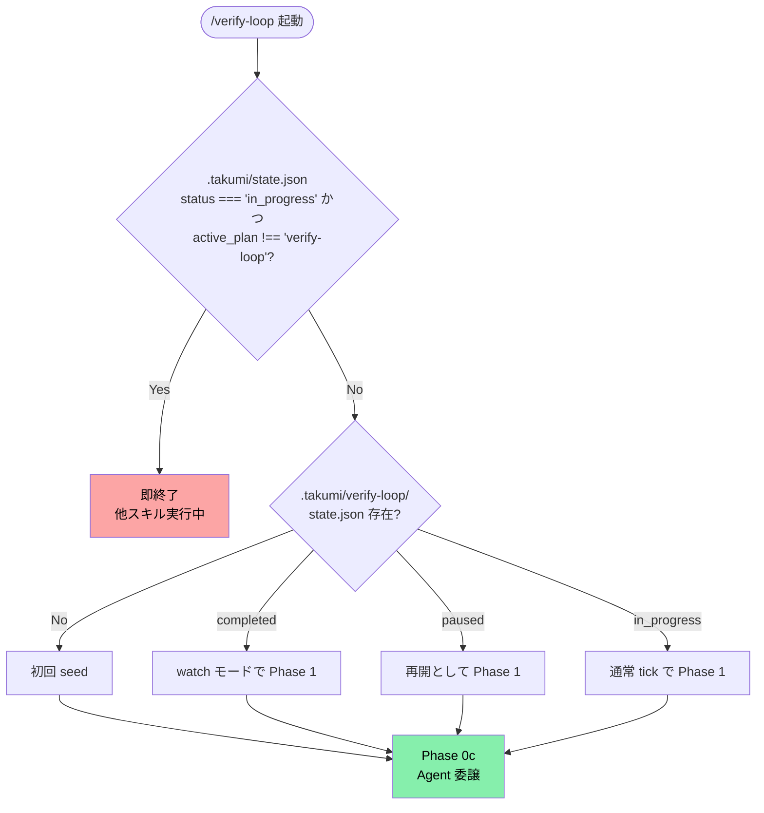

# verify-loop — AI runtime spec

takumi の verify-loop から呼び出される AI エージェントが読む仕様。LP / 用語解説は `README.md` 側。

---

`/loop 10m /verify-loop` のように Claude Code の `/loop` スキルから呼び出す、
**継続テスト拡充 + 圧縮スキル**。運用は 3 Phase 構造:

### Phase 1: Expansion (mutation score を目標へ引き上げる)

A→B→C→D→E の layer を順に。各 tick で 1 ファイルに集中:

1. Stryker incremental で survived mutant を検出
2. tabu 観点を避けつつ finder (arithmetic_boundary / empty_array / null_boundary / ...) を 1 つ選択
3. **SHARPEN** (最優先): 既存 `it('…べき')` の assertion を鋭くして mutant を殺せないか検討 (2 回以上試行)
4. **ADD** (最後の手段): SHARPEN で殺せず、仕様が未表現なら新 `it` を追加
5. 必要に応じて実装バグを修正
6. score を state.json に記録

現在の layer 全員が目標 (通常 80%) 以上に到達したら**次の layer ではなく Phase 2 に遷移**。

### Phase 2: Compression (suite を最小化)

**Entry gate (必須)**: Phase 1 完了条件として、**対象 layer 内の全 file で mutation score が目標 (通常 80%) 以上** に到達していることを確認する。未達の file が 1 つでも残っていれば Phase 1 に留まる。Phase 2 に入ってから SHARPEN すべき mutant を見逃すと suite 全体の鋭さを損なう。

Phase 1 完了後、**E→D→C→B→A の逆順**で各 layer を圧縮。各 tick で 1 ファイル:

1. Stryker `--reporters json` で killed-mutant 集合を test 単位で取得
2. **Subsumption 検出**: `killed(A) ⊇ killed(B)` なら B を削除候補
3. **Zero-contribution 検出**: カバーしてるのに 0 mutant しか殺さないテストを削除候補
4. **Spec-density 算出**: `unique_killed / test_LOC`、0.3 未満を削除候補
5. 候補を **1 件ずつ** 削除 → Stryker 再実行 → score 不変なら削除確定、下がったら revert
6. suite runtime も記録し budget 内か確認

layer の全 file で候補 0 になったら次の layer (E→D→...→A)。
全 layer 完了したら Phase 3 へ。

詳細 recipe は **`~/.claude/skills/takumi/verify/compression.md`**。

### Phase 3: Maintenance (watch モード)

Phase 1 + Phase 2 完了後の定常状態:

- PR で変更されたファイルのみ mutation incremental 再実行
- score 低下 → tick で SHARPEN / ADD (一時的に Phase 1 相当に戻る)
- suite runtime 増大 / spec-density 低下 → tick で PRUNE (一時的に Phase 2 相当)
- drift が月次で閾値以上 → Phase 1 から再スタート (大規模リファクタ後など)

## 本体ドキュメント

詳細な手順・状態ファイル形式・Phase 定義は **`~/.claude/skills/takumi/verify/loop.md`** に集約。
このファイルはエントリーポイントとループガードのみ。

## 使い方

| コマンド | 動作 |
|---------|------|
| `/verify-loop` | 1 tick 実行 (現在の layer / 対象ファイルから自動選択) |
| `/verify-loop continue` | paused 状態から再開 |
| `/verify-loop status` | state.json の要約を表示 |
| `/loop 10m /verify-loop` | 10 分間隔で自動 tick (Claude Code の /loop 経由) |

## Phase 0 — ガード (必ず最初に実行)



### 0a. 他スキルとの競合回避

> [!WARNING]
> `.takumi/state.json` を読み、`status === "in_progress"` かつ `active_plan !== "verify-loop"` なら**即終了**する。他のスキルと同時実行するとプロジェクト状態が壊れる。

`.takumi/state.json` を読む:
- `status === "in_progress"` かつ `active_plan !== "verify-loop"` → **即終了**。
  「他のスキル ({active_plan}) が実行中のためスキップします」と報告して何もしない
- 上記以外 → 続行

### 0b. state.json の存在確認

`.takumi/verify-loop/state.json` を確認:
- 存在しない → **初回 seed** を実行 (後述)
- 存在する `status === "completed"` → **watch モード**で Phase 1 へ (変更ファイル検出のみ)
- 存在する `status === "paused"` → 再開として Phase 1 へ
- 存在する `status === "in_progress"` → 通常 tick として Phase 1 へ

### 0c. Agent 委譲 (必須)

tick 内で Stryker 実行 + mutant 分析 + test 追加 + 検証と context を大量消費するため、
**必ず Agent ツールに委譲する**。Main は Agent の JSON 応答だけを受ける。

<details>
<summary><b>Agent 委譲プロンプト (クリックで展開)</b></summary>

```
Agent(
  description: "verify-loop tick {N}",
  subagent_type: "general-purpose",
  prompt: """
    Read ~/.claude/skills/takumi/verify/loop.md fully and execute Phase 1-6.
    Read CLAUDE.md for the project context.
    Read .takumi/verify-loop/state.json for current state.

    ## I/O 契約 (厳守)
    - Stryker report は .takumi/verify-loop/reports/{tick_n}/{safe_path}.json に保存
    - state.json の書き換えは *.partial → mv *.final (atomic)
    - 最終メッセージは JSON 1 枚のみ (1KB 未満、画像・diff 含めない):
      {
        "tick": N,
        "layer": "A",
        "file": "src/lib/...",
        "before_score": N,
        "after_score": N,
        "finder_used": "arithmetic_boundary",
        "action_taken": "added 2 PBT for boundary values",
        "layer_graduated": false,
        "next_layer": "A",
        "status": "in_progress | paused | completed | watch",
        "one_line_verdict": "..."
      }

    ## 親に返してはいけないもの
    - Stryker html 本文 / 長い survivor 列挙
    - 追加した test コードの本文 (diff)
    - 修正した実装の本文 (diff)
    これらは全て .takumi/verify-loop/ 配下にのみ書く。

    ## tick artifact の書き出し先 (重要)
    - stryker.tick{N}.config.mjs / vitest.stryker-tick{N}.config.ts は
      **リポジトリ root に書き出さない** (tick config が 10+ 個 git 管理下に残る構造的 debt を防止)。
    - 書き出し先は `.takumi/verify-loop/tick-configs/tick{N}/` 配下。
    - .gitignore に `.takumi/` が入っていれば自動的に追跡対象外になる。
    - 既に root に tick config が散らばっている project は、初回 tick 時に
      移行警告を出す (detect: glob で stryker.tick*.config.mjs がルートにある)。

    ## テスト追加時の USS 規約
    - 新規ファイル (.pbt.test.ts 等) は作らない
    - 既存 {module}.test.ts に it('{Subject} は {input} に対して {output} を返すべき', ...) を追加
    - 詳細は ~/.claude/skills/takumi/verify/spec-tests.md

    ## コンテキスト保護
    残量 20% を切ったら state.json を保存し、resume.md を書き、status: "paused" で早期終了。
  """,
  run_in_background: false
)
```

</details>

<details>
<summary><b>Phase 1 以降の 6 phase 詳細 (クリックで展開)</b></summary>

Agent 内で実行される (Main では実行しない)。詳細は `~/.claude/skills/takumi/verify/loop.md`:

1. **Phase 1**: 対象ファイル選択 (tabu と被らない `active`/`pending` から best_score 昇順)
2. **Phase 2**: `pnpm stryker run --incremental --mutate <file>` で survived mutant 抽出
3. **Phase 3**: finder 選択 (tabu に 3 tick 追加) → test 追加 → 必要なら実装修正
4. **Phase 4**: state.json 更新 + layer graduation 判定
5. **Phase 5**: 全 layer 完了なら watch モード移行 (変更ファイル再測定のみ)
6. **Phase 6**: context 残量切迫時の paused 保存

</details>

<details>
<summary><b>初回 seed 手順 (クリックで展開)</b></summary>

state.json が無い時は、`seed-state.md` (同ディレクトリ内) の手順で生成:

1. project のディレクトリを glob で走査
2. 5 layer に振り分け:
   - **A 純粋ロジック**: `src/lib/**/*.ts` (テスト除外), `src/features/*/utils/**/*.ts`
   - **B 状態**: `src/features/*/store/**/*.ts`, `src/features/*/hooks/**/use-*.ts` の reducer/selector
   - **C 永続化境界**: `src/features/*/actions/**-repository.ts`, `src/lib/db/**/*.ts`
   - **D API 入口**: `src/app/api/**/route.ts`
   - **E UI component**: `src/features/*/components/**/*.tsx`
3. 各ファイルを `{path, status: 'pending', best_score: 0, tick_count: 0, ...}` で列挙
4. `current_layer = 'A'`, `layer_order = ['A','B','C','D','E']`, `status = 'in_progress'` で書き出し

</details>

<details>
<summary><b>制約 (クリックで展開)</b></summary>

> [!WARNING]
> 以下の制約は厳守。無視すると context 崩壊・state 壊滅・人間レビュー工数爆発のいずれかが起こる。

- 1 tick = 1 ファイル集中。複数ファイル並列禁止 (context と Stryker 待ちで崩壊)
- Full stryker run は layer graduation 時のみ
- tabu_patterns を無視しない (直近 2-3 tick の観点は除外)
- 実装バグ修正は mutant が「仕様違反」を示す時のみ、それ以外は `discovered-*.md` に落として人間レビュー
- state.json の手動書き換え禁止 (Phase 4 経路のみ)
- stryker html を親に返さない (要約 JSON のみ)
- 1 file の `tick_count > 8` で 80% 未到達なら `skipped_difficult` としてフラグ立てて人間判断へ

</details>

<details>
<summary><b>設計根拠 (クリックで展開)</b></summary>

軍師 (gpt-5.4) との相談結果:

- **レイヤー順 A→E** は mutant kill 難度の低い順。A は入出力明確で PBT が刺さる → 早く 80% 到達 → E (DOM/非同期) は最後に回す
- **file-within-layer の state 管理**: layer 単位の graduation 判定と、個別 file の tick history を両立
- **tabu + finder rotation**: 「同じ観点を繰り返さない」を構造的に保証。直近 2-3 tick で使った finder は tabu、新 tick は別カテゴリから選ぶ
- **incremental mutate**: 1 tick 10 分は 1 ファイル (`--mutate <file>`) が現実的。複数ファイルは待ち時間で崩れる

関連スキル:
- `~/.claude/skills/takumi/verify/README.md` — 検証全体方針
- `~/.claude/skills/takumi/verify/mutation.md` — Stryker 設定詳細
- `~/.claude/skills/takumi/sweep/README.md` — 同系統のループ対応オーケストレーター (参考)

</details>
