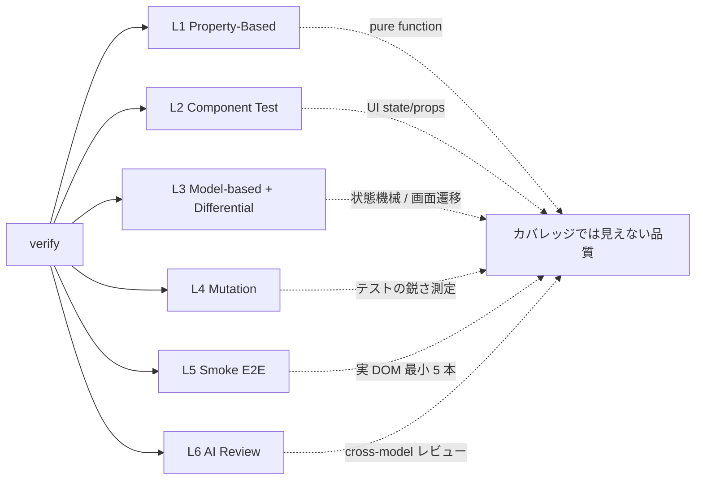

# verify 運用: AI ファーストなテスト戦略 (takumi 内部モード)

<div align="center">


</div>

テストの質を、人間の経験ではなく機械で測る時代へ。

> [!NOTE]
> このファイルは takumi の **verify 運用** 内部 runtime doc です。独立した `/verify` コマンドは廃止され、`/takumi` に「テスト書いて」「検証入れて」「カバレッジ上げて」等の発話を与えると verify 運用が内部的に起動します。人間が覚えるコマンドは `/takumi` 1 つだけ。

```
/takumi テスト増やして
```

プロジェクトを診断し、関数・コンポーネント・状態機械それぞれに最適なテストを自動生成します。ランダム入力 1 万回、mutation score、メタモルフィック関係 — これまで専門家にしか扱えなかった手法を、普通のチームが使えるかたちで導入します。

---

## verify skill の目的 — テスト品質マトリクス

テスト品質を **量** (coverage) × **鋭さ** (mutation score) の 2 軸で捉えると、repo は 4 つの状態に分類できる。**verify skill の主目的は Q3 から Q1 へ、正しい経路で連れていくこと** と **Q4 への drift 防止**。

### 4 象限プロフィール

縦軸 = **鋭さ** (mutation score)、横軸 = **量** (coverage)。

| 象限 | コードネーム | 状態の姿 | 特徴 | 次の手 |
|---|---|---|---|---|
| 🏆 **Q1** | **精鋭大軍** _Elite Army_ | 兵が多く、全員鋭い | mut ≥ 70% かつ cov ≥ 80%、assert 具体的 | 維持。PBT を増やして壁を厚くする |
| 🎯 **Q2** | **少数精鋭** _Lean Elite_ | 少数だが全員鋭い | cov < 50% だが mut ≥ 70%、PBT 主体 | 未カバー領域に USS で 1 unit=1 test を追加 → Q1 |
| 🌱 **Q3** | **白紙** _Blank Slate_ | まだ軍がいない | cov < 30%、mut < 50%、test ほぼ無 | PBT で pure 層を先に押さえる → Q2 |
| 🎭 **Q4** | **張子の虎** _Paper Tiger_ | 兵は多いが張子 | cov > 80% だが mut < 50%、空 assert / snapshot-only / retry 吸収 | **増やすな、鋭くせよ**。既存 test を mutation-kill で refactor |

### 移動経路

- 🌱 **正道** (推奨): `Q3 → Q2 → Q1` — PBT で**鋭さ先行**、後から USS で網羅拡大。test 1 本あたりの情報量が高く、maintenance cost も抑えられる
- 🎭 **注意経路** (AI で起きやすい): `Q3 → Q4 → Q1` — AI で test を量産 → 後から鋭さを足す。**runtime / flake / review surface / ownership の 4 コストが累積**し Q4 滞在で技術負債化しやすい

### Q4 の典型的な症状 (複数シグナル合算で判定)

Q4 は single threshold では判定不能。以下の**複数シグナル合算**で疑う (integration-heavy 等の特殊 domain は閾値調整):

- line coverage > 80% なのに mutation score < 50%
- `expect(result).toBeDefined()` 型の空 assertion が多数
- snapshot-only test で具体値検証が無い
- `it('動作すること', ...)` など Subject / 期待値 不明な test 名
- 1 ファイルに 30+ `it()` で `describe` 構造のみ乱立
- 実装コピペ assertion (production と同じ定数/式を assert に使う)
- 過剰 mocking (production path の大半を mock で置換)
- retry / timeout で flake を吸収し「緑」にしている

### verify skill が取る手段

| ステージ | 手段 | 対応する象限移動 |
|---|---|---|
| **入口ガード** | USS 原則、新規 `*.pbt.test.ts` 禁止、mutation gate、implementation-derived assert 禁止、mocking 最小化、retry 吸収禁止 | Q3 → Q4 への **drift を構造的に阻止** |
| **鋭化ループ** | verify-loop (`/loop 10m /verify-loop`) で survived mutant を観察 → assert 追加 → 再観察 | Q4 → Q2 → Q1 へ **救出** |
| **先回り保護** | PBT (`fast-check`) で pure 層を property で覆う | Q3 → Q2 への **ショートカット** |
| **cross-model audit** | 軍師 (GPT-5.x; baseline gpt-5.4、env.yaml auto で Plus user は gpt-5.5、詳細: `~/skills/takumi/executor.md`「GPT-5.5 upgrade path」) による AI 書き PR レビュー | Q4 drift の **遅延検出** |

### 結論

> **takumi verify は「test を増やす skill」ではない。「test を鋭くする skill」である。**
>
> Q4 (張子の虎) への逃避を構造的に封じ、Q3 → Q2 → Q1 の **質重視経路** を強制する。既存コードが Q4 にいる場合は、追加ではなく既存の mutation-kill による refactor で Q1 に救出する。

---

## 目次

- [こんなお悩み、ありませんか?](#こんなお悩みありませんか)
- [verify が解決すること (6 つの視点)](#verify-が解決すること-6-つの視点)
  - [1. 「テストが鋭いか」を機械が測ります (Mutation Testing)](#1-テストが鋭いかを機械が測ります-mutation-testing)
  - [2. 人間が思いつかない入力を、AI が探します (Property-Based Testing)](#2-人間が思いつかない入力をai-が探します-property-based-testing)
  - [3. 正解がない世界でも検証できます (Metamorphic Testing)](#3-正解がない世界でも検証できます-metamorphic-testing)
  - [4. 複雑な画面遷移を、自動で歩き回ります (Model-based Testing)](#4-複雑な画面遷移を自動で歩き回ります-model-based-testing)
  - [5. 実装と設計が、ズレません (strict-refactoring との統合)](#5-実装と設計がズレません-strict-refactoring-との統合)
  - [6. AI が書いた PR を、別の AI が敵対的にレビューします (AI Review)](#6-ai-が書いた-pr-を別の-ai-が敵対的にレビューします-ai-review)
- [用語解説 (初めて聞く方へ)](#用語解説-初めて聞く方へ)
- [AI 実行時に参照する仕様](#以下ai-実行時に参照する仕様)

---

## こんなお悩み、ありませんか?

> [!TIP]
> 以下のどれか 1 つでも当てはまるなら、verify が効きます。

- テストは書いているのに、本番でバグが出る
- カバレッジ 80% を達成したのに、安心できない
- 境界値や NULL、空配列で壊れることが多い
- 画像生成や ML の出力を「何をもって正しい」とテストすればいいかわからない
- リファクタリングするときに「既存挙動が壊れていないこと」をどう保証するかわからない
- テストが増えるほど遅くなり、開発体験が悪化している

これらは、**テストの書き方が 30 年前の常識のまま止まっている**ことが原因です。verify は、過去 50 年の研究で提案されてきた**本当にいい手法**を、AI の力で実用レベルまで持ち込みます。

---

## verify が解決すること (6 つの視点)



### 1. 「テストが鋭いか」を機械が測ります (Mutation Testing)

> [!IMPORTANT]
> カバレッジ 100% でも、mutant が生存していればテストは**飾り**です。mutation score こそが真の品質指標。

**ミューテーションテストとは**、本番コード側をほんの少し書き換え (たとえば `>` を `>=` に、`true` を `false` に、`+` を `-` に) て、その**わざと植えたバグ**をテストが検知できるかを計測する手法です。

検知できなかったパターン (「生存したミュータント」) の割合が低いほど、テストが本当に意味をなしていることを示します。カバレッジでは絶対に見えない「テストの鋭さ」が数値でわかります。

verify は Stryker というツールを使って、差分 (pre-push) や週次 (CI) でこれを自動計測し、目標値 (デフォルト 65-80%) を超えないコードはリリースさせません。

> [!CAUTION]
> **Stryker は measurement (測定器) であって sharpener ではありません**。どの mutant が生存しているかを**観測する**だけで、**1 回走らせても** test は鋭くなりません。鋭くするには以下のいずれかが必要:
>
> - **ループ**: Stryker 実行 → survived mutant 観察 → test 追加/修正 → 再実行 → 繰り返す。これを回す専用 skill が **[`verify-loop`](../verify-loop/README.md)** (`/loop 10m /verify-loop` で自動回し)
> - **PBT (Property-Based Testing)**: pure function + 有界 input なら、1 つの property が多くの mutant を同時に殺せる。ループ不要で地力を上げる。詳細 → [`property-based.md`](property-based.md)
>
> **現実解**: pure 層は PBT で先回り → 状態を持つ層は verify-loop で回す → それでも残る隙間を hand-written で埋める。単発 Stryker で sharpening を期待しない。

> [!IMPORTANT]
> **L4 Mutation は言語によって役割が変わります**。JS/TS (Stryker-JS) / Java/Kotlin (PIT) / C# (Stryker.NET) / Rust (cargo-mutants) / Scala (Stryker4s) は **primary tier** として mutation score を hard gate に使えます。一方 Python (mutmut) / Go (gremlins) は operator 覆盖が Stryker レベルに届かないため **advisory tier** で telemetry 参考値のみ。その言語では L1 PBT + L6 AI Review を主守りにします。詳細 → `mutation.md` 「対応言語と tier」。

### 2. 人間が思いつかない入力を、AI が探します (Property-Based Testing)

> [!NOTE]
> 1999 年に QuickCheck で登場した古い技術。普及しなかった理由は「性質を言語化する」のが難しかったから。verify はそこを AI が肩代わりします。

**プロパティベーステストとは**、「入力 A → 出力 B」を 1 件ずつ書く代わりに、「どんな入力でも成り立つ性質」を書く手法です。ライブラリが 1 万件ランダムに入力を生成し、反例を見つけるとそれを最小化して提示します。

たとえば `sort(arr)` に対して「長さが変わらない」「ソート後の隣接要素は昇順」「要素集合が不変」の 3 性質で十分です。ケースを個別に列挙する必要がありません。

1999 年に登場した QuickCheck が発祥の古い技術ですが、「性質を言語化する」のが人間には難しく普及しませんでした。verify は関数のシグネチャと仕様 (AC-ID) から、性質と fast-check のコードを**自動生成**します。

### 3. 正解がない世界でも検証できます (Metamorphic Testing)

> [!TIP]
> 画像生成 / ML / LLM の出力 — 「何をもって正しい」か書けない領域では、**関係性**で守ります。

画像生成、機械学習、LLM の出力のように「正解を直接書けない」世界では、**入力をこう変換したら出力もこう変換されるはず**という関係性で検証します。

例:
- 画像を左右反転したら、顔検出の X 座標も反転するはず
- ソート関数に同じ配列を 2 回渡したら結果は同じ (idempotency)
- 翻訳 API に日本語を渡して英語に変え、また日本語に戻しても意味が近いはず

verify はこういった「メタモルフィック関係」を AI が提案し、そのままテストコードに落とし込みます。

### 4. 複雑な画面遷移を、自動で歩き回ります (Model-based Testing)

ログイン → 検索 → カート → 決済 → ... のような長い画面遷移を、人間が全パターン書き起こすのは現実的ではありません。

**モデルベーステストとは**、状態機械 (state machine) を定義し、そこをランダムに歩き回る操作列をライブラリが自動生成する手法です。「検索途中にカートに追加して、キャンセルして、ログアウトして、再ログインして、カートの中身はどうなっている?」といった**人間が思いつかない組み合わせ**を 10,000 通り試します。

verify は状態数に応じて自動で Tier 分類します。

- **Tier A** (状態数 0-2): Component Test で充分
- **Tier B** (状態数 3-8): `fc.commands` で操作列生成
- **Tier C** (状態数 9-20): XState + `@xstate/test` でパス網羅
- **Tier D** (状態数 21 以上): Event Sourcing の不変条件検証

> [!NOTE]
> **ユーザーは状態機械を書きません。** AST 解析で state 数を自動判定し、適切な Tier のテストを生成します。

### 5. 実装と設計が、ズレません (strict-refactoring との統合)

> [!IMPORTANT]
> 一般的なプロジェクトで起こるのが、**本番コードとテストコードで仕様解釈がズレる**現象です。リファクタすると両方を直す必要があり、どちらかが古くなって「テストは通るがバグがある」状態になります。

verify は姉妹スキル **strict-refactoring** と契約を共有します。

| 本番設計の成熟度 | 本番側の契約 | テストがそれを再利用する形 |
|---|---|---|
| Tier A | Props 型 | L2 Component Test |
| Tier B (Pending Object) | `actionPreconditions` 関数を export | L3 `fc.commands` が precondition を**そのまま**使う |
| Tier C (State Machine) | machine 定義そのもの | L3 `@xstate/test` が machine を**そのまま**歩く |
| Tier D (Event Sourcing) | `applyEvent` pure 関数 | L3 event invariants |

> [!TIP]
> **同じオブジェクトを本番とテストが共有するので、原理的に drift (ズレ) が発生しません。**

### 6. AI が書いた PR を、別の AI が敵対的にレビューします (AI Review)

> [!WARNING]
> Claude Sonnet が書いたコードを Claude Opus がレビューすると、同じモデル系列の同じクセで同じ見落としをしがちです。

verify は **OpenAI GPT-5 (codex CLI)** に交差レビューを依頼します。

境界条件、障害パス、競合状態、セキュリティ — 別系統のモデルが「Claude には見えなかった穴」を指摘します。pre-push や CI で自動実行されます。

> [!NOTE]
> **UI 品質の役割分担** (2026-04 採択):
>
> - **L5 Smoke E2E** (本 skill、`smoke-e2e.md`): **critical user journey の実 DOM 最後の砦**、CI 専用。実行時の統合破綻 (navigation 不能 / API 疎通 / auth / 決済等) を守る不可欠な層で、本役割は design mode で代替不能。
> - **L5.5 Visual Regression (VRT)** は **本 skill では採用せず**: 前 pilot で pixel-diff oracle の semantic bug 検出 ceiling を確認。**visual 崩れの prevention 側** は `design/phases-4-6.md` の Phase 6.5 self-review (素人視点 self-check) が担う。L5 Smoke の実 DOM 検証とは目的が異なる (崩れ視認 vs journey 成立) ため併存・補完関係。
> - **L6 AI Review** (本節): PR 直前の広範 oracle (bug / test coverage / security 等の技術規範、GPT-5 交差)。
>
> 呼び出し順序: design Phase 6 実装完了 → **Phase 6.5 self-review (素人視点規範、実装直後監査)** → L5 Smoke (critical journey) → L6 AI Review (技術 oracle) → PR。Phase 6.5 と L6 は規範 (素人視点 vs 技術視点) と timing で役割分離、L5 Smoke は実 DOM 統合の独立層。

---

## 用語解説 (初めて聞く方へ)

| 用語 | 意味 |
|---|---|
| **PBT (Property-Based Testing)** | ランダム入力 1 万回で性質を検証する手法 |
| **mutation score** | 意図的に植えたバグをテストが検知した割合。テストの鋭さを示す |
| **Stryker** | JavaScript/TypeScript 向け mutation testing ツール |
| **fast-check** | JavaScript/TypeScript 向け PBT ライブラリ |
| **fc.commands** | fast-check で**操作列**をランダム生成する API |
| **XState** | 状態機械 (state machine) を TypeScript で書くためのライブラリ |
| **@xstate/test** | XState の状態機械を全パス歩き回ってテストするツール |
| **Pending Object Pattern** | 変更を一度「保留オブジェクト」に集め、validate してからコミットする設計パターン |
| **Event Sourcing** | 状態そのものではなく**状態変化のイベント**を記録する設計 |
| **Metamorphic Testing** | 正解がない領域で、入力と出力の**関係性**で検証する手法 |
| **正解が書ける / 書けない** | そのテストで「期待される出力」を直接コードに書けるかどうか。書ければ `expect(f(x)).toBe(y)` で済み、書けなければ「入力をこう変えたら出力もこう変わるはず」という関係性で検証する (= Metamorphic)。テスト工学では「正解を提供するもの」を英語で **oracle** と呼ぶ |
| **Differential Testing** | 同じ機能の 2 実装 (旧実装 vs 新実装など) を比較して差分を検出する手法 |
| **Smoke E2E** | 最小限の実 DOM を使ったテスト。5 本程度に絞る運用 |
| **AST (Abstract Syntax Tree)** | コードを木構造で解析したもの。状態数の自動判定に使う |

---

---

# AI runtime spec

6 原則 / 6 層スタック / 戦略選択フロー / strict-refactoring 連携 / 実行コスト / 詳細ファイル / 制約は **`runtime.md`** に集約。このファイルは人間向け LP。
