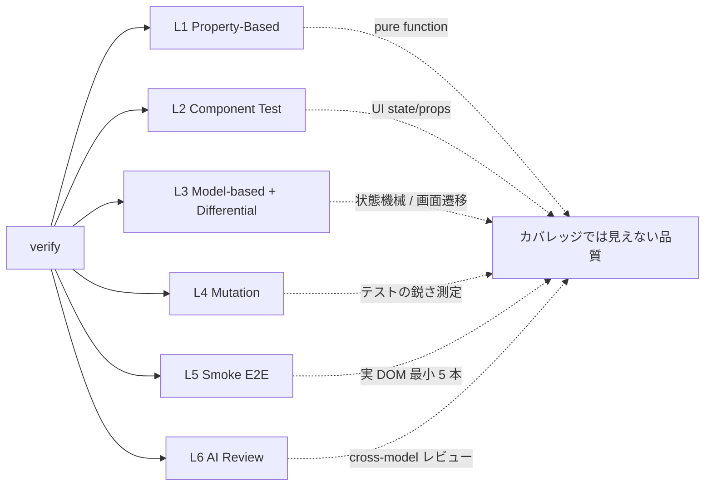
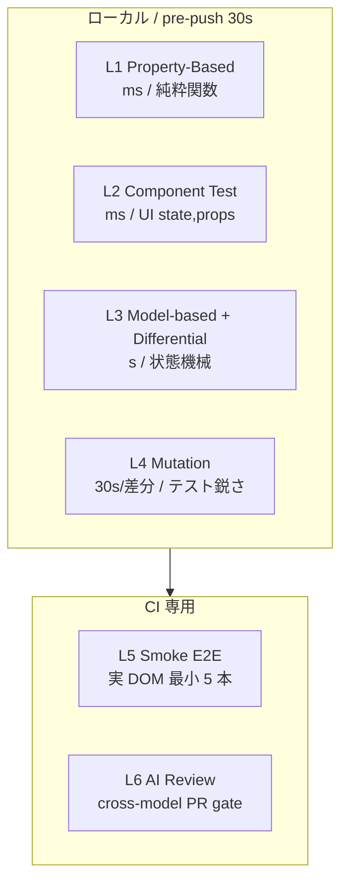
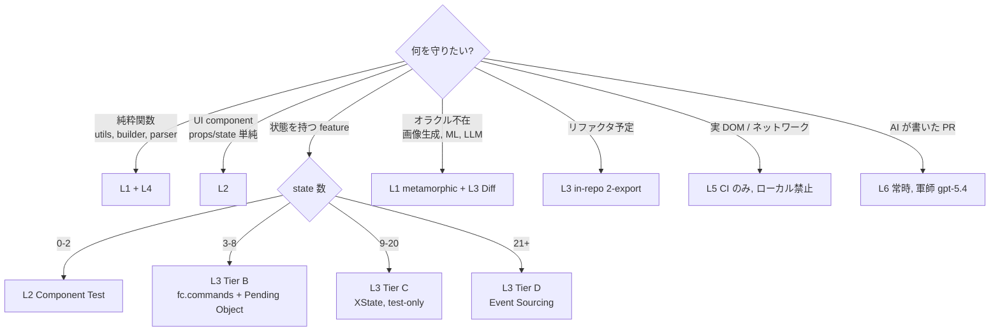

# verify: AI ファーストなテスト戦略スキル

<div align="center">


</div>

テストの質を、人間の経験ではなく機械で測る時代へ。

```
/verify
```

プロジェクトを診断し、関数・コンポーネント・状態機械それぞれに最適なテストを自動生成します。ランダム入力 1 万回、mutation score、メタモルフィック関係 — これまで専門家にしか扱えなかった手法を、普通のチームが使えるかたちで導入します。

---

## 目次

- [こんなお悩み、ありませんか?](#こんなお悩みありませんか)
- [verify が解決すること (6 つの視点)](#verify-が解決すること-6-つの視点)
  - [1. 「テストが鋭いか」を機械が測ります (Mutation Testing)](#1-テストが鋭いかを機械が測ります-mutation-testing)
  - [2. 人間が思いつかない入力を、AI が探します (Property-Based Testing)](#2-人間が思いつかない入力をai-が探します-property-based-testing)
  - [3. 正解がない世界でも検証できます (Metamorphic Testing)](#3-正解がない世界でも検証できます-metamorphic-testing)
  - [4. 複雑な画面遷移を、自動で歩き回ります (Model-based Testing)](#4-複雑な画面遷移を自動で歩き回ります-model-based-testing)
  - [5. 実装と設計が、ズレません (strict-refactoring との統合)](#5-実装と設計がズレません-strict-refactoring-との統合)
  - [6. AI が書いた PR を、別の AI が敵対的にレビューします (AI Review)](#6-ai-が書いた-pr-を別の-ai-が敵対的にレビューします-ai-review)
- [用語解説 (初めて聞く方へ)](#用語解説-初めて聞く方へ)
- [AI 実行時に参照する仕様](#以下ai-実行時に参照する仕様)

---

## こんなお悩み、ありませんか?

> [!TIP]
> 以下のどれか 1 つでも当てはまるなら、verify が効きます。

- テストは書いているのに、本番でバグが出る
- カバレッジ 80% を達成したのに、安心できない
- 境界値や NULL、空配列で壊れることが多い
- 画像生成や ML の出力を「何をもって正しい」とテストすればいいかわからない
- リファクタリングするときに「既存挙動が壊れていないこと」をどう保証するかわからない
- テストが増えるほど遅くなり、開発体験が悪化している

これらは、**テストの書き方が 30 年前の常識のまま止まっている**ことが原因です。verify は、過去 50 年の研究で提案されてきた**本当にいい手法**を、AI の力で実用レベルまで持ち込みます。

---

## verify が解決すること (6 つの視点)



### 1. 「テストが鋭いか」を機械が測ります (Mutation Testing)

> [!IMPORTANT]
> カバレッジ 100% でも、mutant が生存していればテストは**飾り**です。mutation score こそが真の品質指標。

**ミューテーションテストとは**、本番コード側をほんの少し書き換え (たとえば `>` を `>=` に、`true` を `false` に、`+` を `-` に) て、その**わざと植えたバグ**をテストが検知できるかを計測する手法です。

検知できなかったパターン (「生存したミュータント」) の割合が低いほど、テストが本当に意味をなしていることを示します。カバレッジでは絶対に見えない「テストの鋭さ」が数値でわかります。

verify は Stryker というツールを使って、差分 (pre-push) や週次 (CI) でこれを自動計測し、目標値 (デフォルト 65-80%) を超えないコードはリリースさせません。

### 2. 人間が思いつかない入力を、AI が探します (Property-Based Testing)

> [!NOTE]
> 1999 年に QuickCheck で登場した古い技術。普及しなかった理由は「性質を言語化する」のが難しかったから。verify はそこを AI が肩代わりします。

**プロパティベーステストとは**、「入力 A → 出力 B」を 1 件ずつ書く代わりに、「どんな入力でも成り立つ性質」を書く手法です。ライブラリが 1 万件ランダムに入力を生成し、反例を見つけるとそれを最小化して提示します。

たとえば `sort(arr)` に対して「長さが変わらない」「ソート後の隣接要素は昇順」「要素集合が不変」の 3 性質で十分です。ケースを個別に列挙する必要がありません。

1999 年に登場した QuickCheck が発祥の古い技術ですが、「性質を言語化する」のが人間には難しく普及しませんでした。verify は関数のシグネチャと仕様 (AC-ID) から、性質と fast-check のコードを**自動生成**します。

### 3. 正解がない世界でも検証できます (Metamorphic Testing)

> [!TIP]
> 画像生成 / ML / LLM の出力 — 「何をもって正しい」か書けない領域では、**関係性**で守ります。

画像生成、機械学習、LLM の出力のように「正解を直接書けない」世界では、**入力をこう変換したら出力もこう変換されるはず**という関係性で検証します。

例:
- 画像を左右反転したら、顔検出の X 座標も反転するはず
- ソート関数に同じ配列を 2 回渡したら結果は同じ (idempotency)
- 翻訳 API に日本語を渡して英語に変え、また日本語に戻しても意味が近いはず

verify はこういった「メタモルフィック関係」を AI が提案し、そのままテストコードに落とし込みます。

### 4. 複雑な画面遷移を、自動で歩き回ります (Model-based Testing)

ログイン → 検索 → カート → 決済 → ... のような長い画面遷移を、人間が全パターン書き起こすのは現実的ではありません。

**モデルベーステストとは**、状態機械 (state machine) を定義し、そこをランダムに歩き回る操作列をライブラリが自動生成する手法です。「検索途中にカートに追加して、キャンセルして、ログアウトして、再ログインして、カートの中身はどうなっている?」といった**人間が思いつかない組み合わせ**を 10,000 通り試します。

verify は状態数に応じて自動で Tier 分類します。

- **Tier A** (状態数 0-2): Component Test で充分
- **Tier B** (状態数 3-8): `fc.commands` で操作列生成
- **Tier C** (状態数 9-20): XState + `@xstate/test` でパス網羅
- **Tier D** (状態数 21 以上): Event Sourcing の不変条件検証

> [!NOTE]
> **ユーザーは状態機械を書きません。** AST 解析で state 数を自動判定し、適切な Tier のテストを生成します。

### 5. 実装と設計が、ズレません (strict-refactoring との統合)

> [!IMPORTANT]
> 一般的なプロジェクトで起こるのが、**本番コードとテストコードで仕様解釈がズレる**現象です。リファクタすると両方を直す必要があり、どちらかが古くなって「テストは通るがバグがある」状態になります。

verify は姉妹スキル **strict-refactoring** と契約を共有します。

| 本番設計の成熟度 | 本番側の契約 | テストがそれを再利用する形 |
|---|---|---|
| Tier A | Props 型 | L2 Component Test |
| Tier B (Pending Object) | `actionPreconditions` 関数を export | L3 `fc.commands` が precondition を**そのまま**使う |
| Tier C (State Machine) | machine 定義そのもの | L3 `@xstate/test` が machine を**そのまま**歩く |
| Tier D (Event Sourcing) | `applyEvent` pure 関数 | L3 event invariants |

> [!TIP]
> **同じオブジェクトを本番とテストが共有するので、原理的に drift (ズレ) が発生しません。**

### 6. AI が書いた PR を、別の AI が敵対的にレビューします (AI Review)

> [!WARNING]
> Claude Sonnet が書いたコードを Claude Opus がレビューすると、同じモデル系列の同じクセで同じ見落としをしがちです。

verify は **OpenAI GPT-5 (codex CLI)** に交差レビューを依頼します。

境界条件、障害パス、競合状態、セキュリティ — 別系統のモデルが「Claude には見えなかった穴」を指摘します。pre-push や CI で自動実行されます。

---

## 用語解説 (初めて聞く方へ)

| 用語 | 意味 |
|---|---|
| **PBT (Property-Based Testing)** | ランダム入力 1 万回で性質を検証する手法 |
| **mutation score** | 意図的に植えたバグをテストが検知した割合。テストの鋭さを示す |
| **Stryker** | JavaScript/TypeScript 向け mutation testing ツール |
| **fast-check** | JavaScript/TypeScript 向け PBT ライブラリ |
| **fc.commands** | fast-check で**操作列**をランダム生成する API |
| **XState** | 状態機械 (state machine) を TypeScript で書くためのライブラリ |
| **@xstate/test** | XState の状態機械を全パス歩き回ってテストするツール |
| **Pending Object Pattern** | 変更を一度「保留オブジェクト」に集め、validate してからコミットする設計パターン |
| **Event Sourcing** | 状態そのものではなく**状態変化のイベント**を記録する設計 |
| **Metamorphic Testing** | 正解がない領域で、入力と出力の**関係性**で検証する手法 |
| **Differential Testing** | 同じ機能の 2 実装 (旧実装 vs 新実装など) を比較して差分を検出する手法 |
| **Smoke E2E** | 最小限の実 DOM を使ったテスト。5 本程度に絞る運用 |
| **AST (Abstract Syntax Tree)** | コードを木構造で解析したもの。状態数の自動判定に使う |

---

# 以下、AI 実行時に参照する仕様

> [!NOTE]
> ここから先は `/verify` を実行した AI エージェントが実行手順を読むための仕様セクションです。人間が読んでも構いませんが、分量が多くなります。内容は一字一句、runtime の動作仕様です。

---

## 5 原則

1. **入力空間は AI が網羅** — example より property
2. **テストの質は機械が測る** — coverage より mutation score
3. **正解が無い世界は metamorphic で守る** — output 直接判定を諦める
4. **状態機械は操作列で網羅** — E2E は smoke 5 本だけ
5. **検出は左から右へ** — 型 → unit → mutation → 本番観測

---

## 6 層の検証スタック



| 層 | 何を | コスト | 内部参照 |
|---|---|---|---|
| L1 Property-Based | 入力空間 (純粋関数) | ms | `property-based.md` |
| L2 **Component Test** | UI component の state / props 空間 | ms | `component-test.md` |
| L3 Model-based + Differential | 状態機械 / 画面遷移 / 別実装比較 | s | `model-based.md` |
| L4 Mutation | テスト自体の鋭さ測定 | 30s/差分 | `mutation.md` |
| L5 Smoke E2E | 実 DOM 最小 5 本 | CI のみ | `smoke-e2e.md` |
| L6 AI Review | PR ゲート (軍師 cross-model) | API 呼出 | `ai-review.md` |

補助: `differential.md` (L3 の in-repo 2-export パターン)、
`machine-generator.md` (L3 の AI 自動生成パイプライン、Tier 分類、probe 統合)。

**ループ運用**: `/loop 10m /verify-loop` で各レイヤーの mutation score を順に 80% 以上へ引き上げる
継続サイクル (`loop.md`) を持つ。同じ観点を繰り返さず A→B→C→D→E の作業層を rotate する。

---

## 戦略選択フロー



<details>
<summary>ASCII art 版 (同内容)</summary>

```
何を守りたい?
├─ 純粋関数 (utils, builder, parser)     → L1 + L4
├─ UI component (props/state 単純)       → L2
├─ 状態を持つ feature                    → L3 (Tier で自動分類)
│   ├─ state 0-2 → L2 Component Test
│   ├─ state 3-8 → L3 Tier B (fc.commands + Pending Object)
│   ├─ state 9-20 → L3 Tier C (XState, test-only)
│   └─ state 21+ → L3 Tier D (Event Sourcing)
├─ オラクル不在 (画像生成, ML, LLM)      → L1 (metamorphic) + L3 Diff
├─ リファクタ予定                        → L3 in-repo 2-export
├─ 実 DOM / ネットワーク                 → L5 (CI のみ、ローカル禁止)
└─ AI が書いた PR                        → L6 (常時、軍師 gpt-5.4)
```

</details>

Tier 分類は **AST スコアリングで自動判定** (`machine-generator.md` Stage 2)。

---

## strict-refactoring との統合 (重要)

> [!IMPORTANT]
> strict-refactoring が **production の設計を決める**。verify は **テスト形式を 1 対 1 で追従**。両者が同じ precondition / machine / applyEvent を共有するため **drift しない**。

本番コードの設計進化と verify の Tier は **1 対 1 対応**:

| Tier | 本番設計 (strict-refactoring) | 共有契約 | テスト (verify) |
|---|---|---|---|
| A | useState 直書き | Props 型 | L2 Component Test |
| B | **Pending Object** (useReducer + `actionPreconditions` export) | precondition 関数 | L3 fc.commands (precondition 再利用) |
| C | **State Machine** (state > 8 で昇格、XState or plain TS) | machine 自体 | L3 @xstate/test (test-only XState) |
| D | **Event Sourcing** (state > 20 or canvas/realtime) | `applyEvent` pure 関数 | L3 Event invariants |

---

<details>
<summary><strong>起動パターン</strong> — 入力と動作の対応表</summary>

| 入力 | 動作 |
|---|---|
| `/verify` | プロジェクト診断 + 6 層導入 |
| `/verify run` | L1 + L4 Mutation incremental + L6 (pre-push 30s) |
| `/verify pbt <ファイル>` | property test を生成 |
| `/verify mutation` | Stryker フル実行 (週次) |
| `/verify machines init` | AI 生成パイプライン (Stage 1-5) を project に導入 |
| `/verify machines generate [--incremental]` | Tier 分類 + テスト/machine 自動生成 |
| 自動: 「テスト書いて」「カバレッジ上げて」等 | 戦略選択フロー経由 |

</details>

<details>
<summary><strong>初回セットアップフロー</strong> (<code>/verify</code>) — 9 ステップ</summary>

1. プロジェクト構造解析 (Next.js / 純 TS / monorepo)
2. テスト基盤確認 (Vitest / Jest / Playwright)
3. **L1 導入**: `pnpm add -D fast-check`、`src/test/pbt-utils.ts` 生成
4. **L2 導入**: RTL 確認、`src/test/component-arbitraries.ts` 生成
5. **L3 導入**: `verify machines init` → scripts/ + `.takumi/machines/shared/` + pre-commit 登録
6. **L4 導入**: `pnpm add -D @stryker-mutator/core @stryker-mutator/vitest-runner @stryker-mutator/typescript-checker`、`stryker.config.mjs` 生成
7. **L5 整理**: 既存 Playwright を CI 専用 smoke 5 本に絞る
8. **L6 提案**: `.github/workflows/oracle-review.yml` 生成 (codex CLI 前提)
9. **pre-push hook 登録**: `/verify run` を `.husky/pre-push` に

各ステップは **ユーザー確認を取らずに連続実行**。

</details>

---

## `/verify run` の中身 (30 秒以下)

```bash
pnpm test --run                              # L1 + L2 + L3 の通常 vitest
pnpm stryker run --incremental               # L4 差分のみ
claude-code review --staged  # or codex      # L6 AI レビュー
```

3 つ全部 PASS で 0 終了。1 つでも失敗で push ブロック。

---

## 既存スキルとの役割分担

| スキル / コマンド | 役割 |
|---|---|
| **verify** (本スキル) | テスト追加・実行・Tier 分類 |
| **strict-refactoring** plugin | 本番コード設計 (Pending Object → State Machine → Event Sourcing) |
| 組み込み `/review` | 既存コードの品質検出 |
| 組み込み `/security-review` | セキュリティ検出 |
| `/refactor-clean` | 死コード削除 |
| `/build-fix` | ビルド/型エラー修正 |
| `probe` / `sweep` | 全体スイープ (pre-commit 経由で verify と統合) |

**設計 = strict-refactoring**、**テスト = verify**、**修正 = /refactor-clean / /build-fix**。役割を混ぜない。

---

<details>
<summary><strong>依存ライブラリ</strong> (最小化方針)</summary>

production bundle に追加: **なし** (設計自由、既存 useState / Zustand / Jotai 維持)

devDependencies に追加:
- `fast-check` (必須、L1 + L2 + L3 Tier B/D で使用)
- `@testing-library/react` (既存でなければ、L2 用)
- `@stryker-mutator/core` + `vitest-runner` + `typescript-checker` (L4)
- `xstate` + `@xstate/test` (**Tier C 画面が存在する場合のみ**、オプトイン)

**追加しないもの**: ts-morph (scripts は regex で済ませる)、Jest (Vitest 推奨)、dedicated state library。

</details>

<details>
<summary><strong>ローカル実行コスト</strong> (M3 Mac)</summary>

| 検証 | 頻度 | 1 回コスト |
|---|---|---|
| L1 PBT | `pnpm test` | +0.5 秒/file |
| L2 Component Test | `pnpm test` | +0.5 秒/file |
| L3 Model-based | `pnpm test` | 2-5 秒 (numRuns=100) |
| L3 Differential (in-repo) | `pnpm test` | +1-3 秒 |
| L4 Mutation incremental | pre-push | 20-40 秒 |
| L4 Mutation full | 週次 CI | 5-15 分 |
| L5 Playwright smoke | CI 専用 | 60 秒 (**ローカル禁止**) |
| L6 AI Review | PR ごと | 10-30 秒 |
| machine generate incremental | pre-commit | 5-15 秒 |

**ローカル合計 30 秒以下**。Docker hang 問題は構造的に発生しない。

</details>

<details>
<summary><strong>詳細ファイル</strong> (必要時 Read)</summary>

| ファイル | 内容 |
|---|---|
| `property-based.md` | fast-check 6 流派 |
| `component-test.md` | L2 RTL + fc パターン |
| `model-based.md` | L3 4-Tier + strict-refactoring 統合 |
| `differential.md` | in-repo 2-export パターン |
| `mutation.md` | Stryker 設定 + 運用 |
| `smoke-e2e.md` | Playwright 5 本 + CI 構成 |
| `ai-review.md` | 軍師 cross-model レビュー |
| `machine-generator.md` | AI 生成 5 stage パイプライン + probe 統合 |
| `loop.md` | `/loop 10m /verify-loop` — レイヤー A→E を順に mutation 80% へ引き上げる継続ループ |
| `scripts/extract-routes.ts` | Stage 1: Next.js route 抽出 (依存ゼロ) |
| `scripts/score-metrics.ts` | Stage 2: Tier 判定 (regex、依存ゼロ) |
| `scripts/generate.ts` | Stage 3-5: AI 生成オーケストレータ |
| `prompts/tier-a.txt` | Tier A (Component Test) 生成プロンプト |
| `prompts/tier-b.txt` | Tier B (Pending Object + fc.commands) 生成 |
| `prompts/tier-c.txt` | Tier C (XState + @xstate/test) 生成 |
| `prompts/tier-d.txt` | Tier D (Event Sourcing) 生成 |
| `prompts/drift.txt` | Stage 5 (3 view 三角測量) |

</details>

---

<details>
<summary><strong>制約</strong> — 運用上の禁止事項と必須事項</summary>

> [!CAUTION]
> これらは運用上の不変条件です。違反すると Docker hang / drift / production 汚染などの構造的問題が発生します。

- ローカルで Playwright を走らせない (Docker hang 防止)
- Mutation full run は週次のみ (pre-push は incremental)
- production の state management library は**一切触らない** (依存追加禁止)
- Pending Object (Tier B) の `actionPreconditions` は必ず export (L3 fc.commands が再利用)
- XState (Tier C) は **devDependencies 固定**、production 非混入
- AI 生成された machine / test は **手修正禁止** (修正は intent.md 経由)
- 1 machine 40 states 超で分割必須
- AI が自信を持てない遷移は `machine.md` に明示 (黙って生成しない)
- pre-commit は incremental 専用
- Tier 分類は **AST 自動**、人間は intent.md で例外指定のみ

</details>
