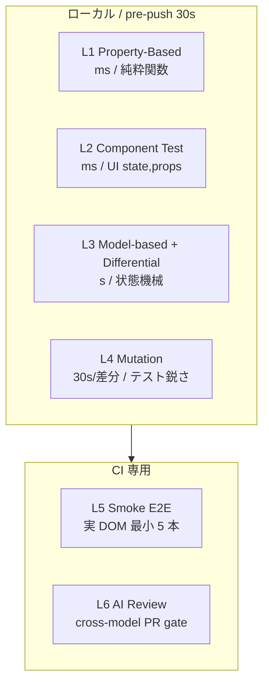
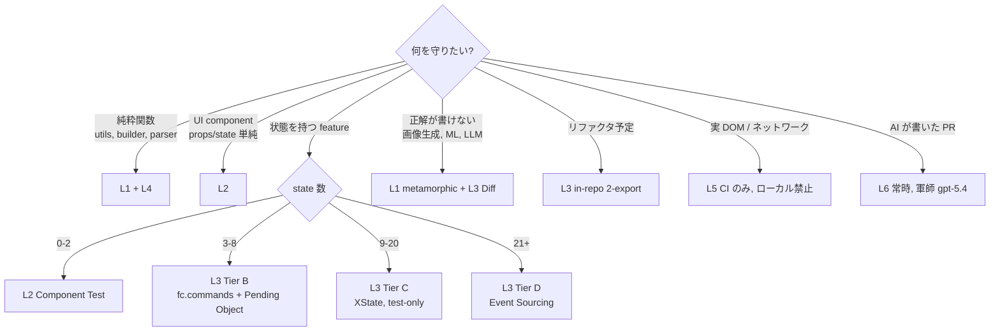

# verify — AI runtime spec

takumi の verify 運用で呼び出された AI エージェントが読む仕様。LP / 用語解説は `README.md` 側。

---

> ここから先は takumi の verify 運用で呼び出された AI エージェントが実行手順を読むための仕様セクションです。人間が読んでも構いませんが、分量が多くなります。内容は一字一句、runtime の動作仕様です。

---

## 7 原則

1. **入力空間は AI が網羅** — example より property
2. **テストの質は機械が測る** — coverage より mutation score
3. **正解が無い世界は metamorphic で守る** — output 直接判定を諦める
4. **状態機械は操作列で網羅** — E2E は smoke 5 本だけ
5. **検出は左から右へ** — 型 → unit → mutation → 本番観測
6. **1 unit = 1 test file = 仕様書 (USS)** — `.pbt.test.ts` / `.mutation.test.ts` / `.metamorphic.test.ts` 等の機構別ファイル分割を**禁止**。`it('{Subject} は {input} に対して {output} を返すべき')` の中で PBT / metamorphic / commands を選ぶ。詳細 → `spec-tests.md` (strict-refactoring Rule 14 を継承)
7. **テストは最小かつ最鋭 (MSS)** — mutation 対応は **SHARPEN > PRUNE > ADD** の優先順位。score が目標に達したら冗長・無意味なテストを**削除**して suite を圧縮する。**削除も first-class action**。詳細 → `spec-tests.md` §8 / `compression.md`

> [!IMPORTANT]
> **原則 6 (USS)** は「鋭いテスト専用ファイル」の構造的問題を根絶する最重要不変条件。
> **原則 7 (MSS)** は AI の add-bias を構造で矯正する。test を足し続けると suite が膨張してコンテキスト食い・実行時間増・可読性低下を招く。**削除も仕事**として明示的に reward する。

---

## 6 層の検証スタック



| 層 | 何を | コスト | 内部参照 |
|---|---|---|---|
| L1 Property-Based | 入力空間 (純粋関数) | ms | `property-based.md` |
| L2 **Component Test** | UI component の state / props 空間 | ms | `component-test.md` |
| L3 Model-based + Differential | 状態機械 / 画面遷移 / 別実装比較 | s | `model-based.md` |
| L4 Mutation | テスト自体の鋭さ測定 | 30s/差分 | `mutation.md` |
| L5 Smoke E2E | 実 DOM 最小 5 本 | CI のみ | `smoke-e2e.md` |
| L6 AI Review | PR ゲート (軍師 cross-model) | API 呼出 | `ai-review.md` |

補助: `differential.md` (L3 の in-repo 2-export パターン)、
`machine-generator.md` (L3 の AI 自動生成パイプライン、Tier 分類、probe mode 統合)、
`spec-tests.md` (USS — 1 unit = 1 test file、it 名は仕様文)。

**ループ運用**: `/loop 10m /verify-loop` (`/loop` は Claude Code 組込 skill) で各レイヤーの mutation score を順に 80% 以上へ引き上げる継続サイクル (`loop.md`) を持つ。同じ観点を繰り返さず A→B→C→D→E の作業層を rotate する。生き残った mutant への対応は **既存 `{m}.test.ts` 内の `it('…べき')` を鋭くする**、または新しい `it('…べき')` を同ファイルに追加する (**`.mutation.test.ts` は作らない**)。

---

## 戦略選択フロー



<details>
<summary>ASCII art 版 (同内容)</summary>

```
何を守りたい?
├─ 純粋関数 (utils, builder, parser)     → L1 + L4
├─ UI component (props/state 単純)       → L2
├─ 状態を持つ feature                    → L3 (Tier で自動分類)
│   ├─ state 0-2 → L2 Component Test
│   ├─ state 3-8 → L3 Tier B (fc.commands + Pending Object)
│   ├─ state 9-20 → L3 Tier C (XState, test-only)
│   └─ state 21+ → L3 Tier D (Event Sourcing)
├─ 正解が書けない (画像生成, ML, LLM)    → L1 (metamorphic) + L3 Diff
├─ リファクタ予定                        → L3 in-repo 2-export
├─ 実 DOM / ネットワーク                 → L5 (CI のみ、ローカル禁止)
└─ AI が書いた PR                        → L6 (常時、軍師 gpt-5.4)
```

</details>

Tier 分類は **AST スコアリングで自動判定** (`machine-generator.md` Stage 2)。

---

## strict-refactoring との統合 (重要)

> [!IMPORTANT]
> strict-refactoring が **production の設計を決める**。verify は **テスト形式を 1 対 1 で追従**。両者が同じ precondition / machine / applyEvent を共有するため **drift しない**。

本番コードの設計進化と verify の Tier は **1 対 1 対応**:

| Tier | 本番設計 (strict-refactoring) | 共有契約 | テスト (verify) |
|---|---|---|---|
| A | useState 直書き | Props 型 | L2 Component Test |
| B | **Pending Object** (useReducer + `actionPreconditions` export) | precondition 関数 | L3 fc.commands (precondition 再利用) |
| C | **State Machine** (state > 8 で昇格、XState or plain TS) | machine 自体 | L3 @xstate/test (test-only XState) |
| D | **Event Sourcing** (state > 20 or canvas/realtime) | `applyEvent` pure 関数 | L3 Event invariants |

---

<details>
<summary><strong>起動パターン</strong> — 入力と動作の対応表</summary>

verify は takumi の内部モードであり、人間が直接叩く `/verify` コマンドは存在しない。以下は takumi が内部的に分岐する動作表:

| takumi への発話 | 内部動作 |
|---|---|
| 「テスト書いて」「テスト増やして」「検証入れて」 | プロジェクト診断 + 6 層導入 (初回セットアップ or 差分追加) |
| 自動 (pre-push hook) | L1 + L4 Mutation incremental + L6 (30s 以下) |
| 「<ファイル> に property test を」 | 該当 `{m}.test.ts` に `it('…べき')` を追加 (新規 .pbt.test.ts を作らない) |
| 「mutation フル回して」「週次検証」 | Stryker フル実行 (週次 CI 相当) |
| 「画面遷移のテスト生成」 | machine 生成パイプライン (Stage 1-5) |
| 「テスト追加して」「カバレッジ上げて」 | 戦略選択フロー経由で最適な層を選ぶ |

</details>

<details>
<summary><strong>初回セットアップフロー</strong> — 9 ステップ</summary>

1. プロジェクト構造解析 (Next.js / 純 TS / monorepo)
2. テスト基盤確認 (Vitest / Jest / Playwright)
3. **L1 導入**: `pnpm add -D fast-check`、`src/test/pbt-utils.ts` 生成
4. **L2 導入**: RTL 確認、`src/test/component-arbitraries.ts` 生成
5. **L3 導入**: `verify machines init` → scripts/ + `.takumi/machines/shared/` + pre-commit 登録
6. **L4 導入**: `pnpm add -D @stryker-mutator/core @stryker-mutator/vitest-runner @stryker-mutator/typescript-checker`、`stryker.config.mjs` 生成
7. **L5 整理**: 既存 Playwright を CI 専用 smoke 5 本に絞る
8. **L6 提案**: `.github/workflows/oracle-review.yml` 生成 (codex CLI 前提)
9. **pre-push hook 登録**: verify 運用の pre-push スクリプトを `.husky/pre-push` に (詳細は「pre-push 自動 run の中身」節)

各ステップは **ユーザー確認を取らずに連続実行**。

</details>

---

## pre-push 自動 run の中身 (30 秒以下)

```bash
pnpm test --run                              # L1 + L2 + L3 の通常 vitest
pnpm stryker run --incremental               # L4 差分のみ
claude-code review --staged  # or codex      # L6 AI レビュー
```

3 つ全部 PASS で 0 終了。1 つでも失敗で push ブロック。`.husky/pre-push` に登録される (takumi の初回セットアップで自動導入)。

---

## 既存スキルとの役割分担

| スキル / コマンド | 役割 |
|---|---|
| **verify** (本スキル) | テスト追加・実行・Tier 分類 |
| **strict-refactoring** plugin | 本番コード設計 (Pending Object → State Machine → Event Sourcing) |
| 組み込み `/review` | 既存コードの品質検出 |
| 組み込み `/security-review` | セキュリティ検出 |
| `refactor-clean` skill | 死コード削除 |
| `build-fix` skill | ビルド/型エラー修正 |
| takumi の probe mode / sweep mode | 全体スイープ (pre-commit 経由で verify と統合) |

**設計 = strict-refactoring**、**テスト = verify**、**修正 = refactor-clean / build-fix**。役割を混ぜない。いずれも takumi から自然文で呼び分ける。

---

<details>
<summary><strong>依存ライブラリ</strong> (最小化方針)</summary>

production bundle に追加: **なし** (設計自由、既存 useState / Zustand / Jotai 維持)

devDependencies に追加:
- `fast-check` (必須、L1 + L2 + L3 Tier B/D で使用)
- `@testing-library/react` (既存でなければ、L2 用)
- `@stryker-mutator/core` + `vitest-runner` + `typescript-checker` (L4)
- `xstate` + `@xstate/test` (**Tier C 画面が存在する場合のみ**、オプトイン)

**追加しないもの**: ts-morph (scripts は regex で済ませる)、Jest (Vitest 推奨)、dedicated state library。

</details>

<details>
<summary><strong>ローカル実行コスト</strong> (M3 Mac)</summary>

| 検証 | 頻度 | 1 回コスト |
|---|---|---|
| L1 PBT | `pnpm test` | +0.5 秒/file |
| L2 Component Test | `pnpm test` | +0.5 秒/file |
| L3 Model-based | `pnpm test` | 2-5 秒 (numRuns=100) |
| L3 Differential (in-repo) | `pnpm test` | +1-3 秒 |
| L4 Mutation incremental | pre-push | 20-40 秒 |
| L4 Mutation full | 週次 CI | 5-15 分 |
| L5 Playwright smoke | CI 専用 | 60 秒 (**ローカル禁止**) |
| L6 AI Review | PR ごと | 10-30 秒 |
| machine generate incremental | pre-commit | 5-15 秒 |

**ローカル合計 30 秒以下**。Docker hang 問題は構造的に発生しない。

</details>

<details>
<summary><strong>詳細ファイル</strong> (必要時 Read)</summary>

| ファイル | 内容 |
|---|---|
| `spec-tests.md` | **USS — 1 unit = 1 test file、命名規約 (Rule 14)、anti-pattern、mutation feedback** |
| `property-based.md` | fast-check 6 流派 |
| `component-test.md` | L2 RTL + fc パターン |
| `model-based.md` | L3 4-Tier + strict-refactoring 統合 |
| `differential.md` | in-repo 2-export パターン |
| `mutation.md` | Stryker 設定 + 運用 |
| `smoke-e2e.md` | Playwright 5 本 + CI 構成 |
| `ai-review.md` | 軍師 cross-model レビュー |
| `machine-generator.md` | AI 生成 5 stage パイプライン + probe 統合 |
| `loop.md` | `/loop 10m /verify-loop` — レイヤー A→E を順に mutation 80% へ引き上げる継続ループ |
| `examples/scripts/extract-routes.ts` | (参考例) Stage 1: Next.js route 抽出。project 側に cp して改変 |
| `examples/scripts/score-metrics.ts` | (参考例) Stage 2: Tier 判定 (regex)。project 側に cp して改変 |
| `examples/scripts/generate.ts` | (参考例) Stage 3-5: AI 生成オーケストレータ。project 側に cp して改変 |
| `prompts/tier-a.txt` | Tier A (Component Test) 生成プロンプト |
| `prompts/tier-b.txt` | Tier B (Pending Object + fc.commands) 生成 |
| `prompts/tier-c.txt` | Tier C (XState + @xstate/test) 生成 |
| `prompts/tier-d.txt` | Tier D (Event Sourcing) 生成 |
| `prompts/drift.txt` | Stage 5 (3 view 三角測量) |

</details>

---

<details>
<summary><strong>制約</strong> — 運用上の禁止事項と必須事項</summary>

> [!CAUTION]
> これらは運用上の不変条件です。違反すると Docker hang / drift / production 汚染などの構造的問題が発生します。

- ローカルで Playwright を走らせない (Docker hang 防止)
- Mutation full run は週次のみ (pre-push は incremental)
- production の state management library は**一切触らない** (依存追加禁止)
- Pending Object (Tier B) の `actionPreconditions` は必ず export (L3 fc.commands が再利用)
- XState (Tier C) は **devDependencies 固定**、production 非混入
- AI 生成された machine / test は **手修正禁止** (修正は intent.md 経由)
- 1 machine 40 states 超で分割必須
- AI が自信を持てない遷移は `machine.md` に明示 (黙って生成しない)
- pre-commit は incremental 専用
- Tier 分類は **AST 自動**、人間は intent.md で例外指定のみ

</details>
